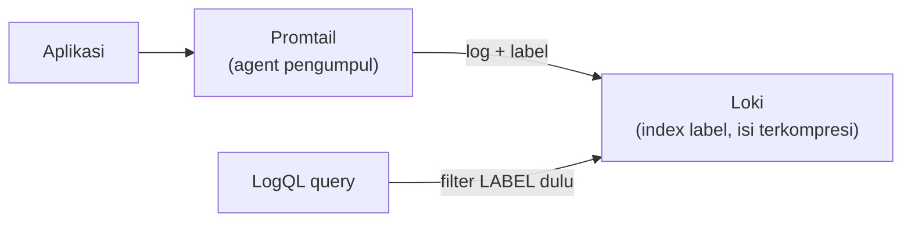

## What It Is, In One Paragraph

Loki adalah sistem agregasi log dari tim yang sama dengan Grafana, dirancang dengan filosofi berbeda dari Elasticsearch untuk kebutuhan log — alih-alih mengindeks seluruh isi setiap baris log (mahal untuk volume besar), Loki hanya mengindeks **label/metadata** (nama service, level, environment) dan menyimpan isi log itu sendiri terkompresi, membuatnya jauh lebih murah dioperasikan untuk volume log tinggi.

## The Concept It Implements

Loki adalah implementasi log-aggregation untuk [[../70 Infrastructure and Delivery/Structured Logging and Log Levels|Structured Logging and Log Levels]] — log terstruktur yang dibahas abstrak di note itu adalah bentuk paling optimal dikonsumsi Loki, karena label yang diindeks biasanya diambil dari field terstruktur.

## Kapan Ini Dipakai

Loki paling masuk akal ketika volume log sudah cukup besar sehingga biaya mengindeks penuh (seperti Elasticsearch) jadi masalah nyata — lihat pertimbangan biaya di [[../94 Case Studies/Case - Log Volume That Costs More Than The Servers|Case - Log Volume That Costs More Than The Servers]]. Untuk volume log kecil-menengah yang juga butuh pencarian teks bebas mendalam di seluruh isi log, Elasticsearch tetap lebih fleksibel meski lebih mahal.

## Mental Model Singkat

Log dikirim (biasanya lewat agent seperti Promtail) dengan **label** yang menentukan stream mana log itu masuk — pencarian di Loki dimulai dari memfilter berdasarkan label (murah, karena terindeks), baru kemudian memindai isi log dalam stream yang sudah difilter itu (lebih mahal, tapi cakupannya sudah dipersempit signifikan oleh filter label).



## Contoh Konkret

```logql
{service="kasus-service", level="error"} |= "timeout"
```

## Kapan Memilih Ini vs Alternatif

Pilih Loki untuk volume log tinggi di mana biaya indexing penuh jadi perhatian nyata, terutama kalau sudah memakai Grafana untuk metrik (integrasi mulus dalam satu antarmuka). Pilih Elasticsearch untuk kebutuhan pencarian teks bebas yang lebih dalam dan fleksibel di seluruh isi log.

> [!warning] Jebakan
> Membuat label dengan cardinality sangat tinggi (misalnya user ID unik sebagai label) — bertentangan dengan filosofi Loki yang mengasumsikan label berjumlah terbatas dan berulang, cardinality tinggi bisa membebani index label secara signifikan.

## Version Caveat

Dokumentasi resmi grafana.com/oss/loki adalah sumber kebenaran untuk sintaks LogQL dan fitur yang benar-benar dipakai untuk versi tertentu.

## Connected Notes

- [[../70 Infrastructure and Delivery/Structured Logging and Log Levels|Structured Logging and Log Levels]] — log terstruktur yang paling optimal dikonsumsi Loki.
- [[../94 Case Studies/Case - Log Volume That Costs More Than The Servers|Case - Log Volume That Costs More Than The Servers]] — skenario nyata yang jadi alasan kuat memilih Loki dibanding indexing penuh.
- [[Elasticsearch]] — kontras langsung sebagai alternatif indexing penuh untuk kebutuhan log dan pencarian.
- [[Grafana]] — antarmuka visualisasi yang terintegrasi mulus dengan Loki, dari tim yang sama.

## Catatan Saya

*Kosong — diisi pembaca.*
