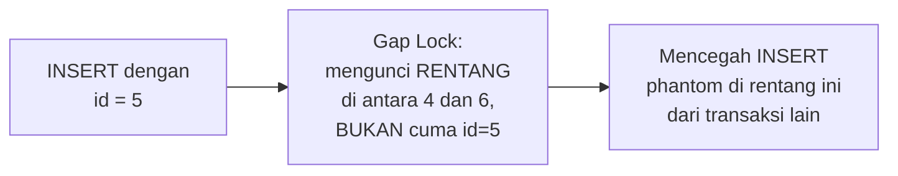

## What It Is, In One Paragraph

MariaDB adalah fork MySQL yang dibuat tahun 2009 setelah akuisisi MySQL oleh Oracle, dan sejak itu berkembang sebagai proyek independen — keduanya masih sangat mirip di permukaan (kompatibel driver, sintaks dasar sama), tapi sudah mulai bercabang di detail dialek dan fitur seiring waktu. Untuk daily driver 13 aplikasi Yii1/Yii2, memahami perilaku InnoDB spesifik dan jebakan dialek MySQL/MariaDB adalah pengetahuan operasional sehari-hari, bukan sekadar teori.

## The Concept It Implements

InnoDB (storage engine default MySQL/MariaDB modern) adalah implementasi konkret [[../40 Databases/ACID|ACID]] dan [[../40 Databases/Basic Isolation Levels|Basic Isolation Levels]] — dengan detail perilaku (default `REPEATABLE READ`, mekanisme gap lock) yang berbeda cukup signifikan dari PostgreSQL meski keduanya sama-sama mengklaim mendukung isolation level yang sama secara nominal.

## Mental Model

Tiga hal yang membedakan pengalaman kerja dengan MySQL/MariaDB dari database lain: **InnoDB sebagai storage engine default** (mesin penyimpanan yang menangani transaksi dan locking — versi lama MySQL punya beberapa storage engine dengan trade-off berbeda, tapi InnoDB sudah jadi standar de facto untuk kebutuhan transaksional); **gap lock dan next-key locking** (mekanisme locking InnoDB yang mengunci **rentang** di antara baris, bukan hanya baris yang ada, untuk mencegah phantom read — perilaku yang mengejutkan pemula karena bisa mengunci baris yang bahkan belum ada); dan **implicit type coercion yang longgar** (MySQL secara historis lebih permisif mengonversi tipe data otomatis dibanding PostgreSQL yang ketat, sumber bug halus yang lolos tanpa error).



## The 20% You Actually Use

```sql
-- ON DUPLICATE KEY UPDATE: upsert versi MySQL/MariaDB
INSERT INTO kasus_counter (tanggal, jumlah) VALUES (CURDATE(), 1)
ON DUPLICATE KEY UPDATE jumlah = jumlah + 1;

-- Memeriksa storage engine tabel
SHOW TABLE STATUS WHERE Name = 'kasus';

-- Memeriksa isolation level aktif
SELECT @@transaction_isolation;

-- EXPLAIN untuk memahami rencana eksekusi query
EXPLAIN SELECT * FROM kasus WHERE status = 'diajukan';
```

```go
// go-idiomatic: driver go-sql-driver/mysql, kompatibel MySQL dan
// MariaDB
import _ "github.com/go-sql-driver/mysql"

db, err := sql.Open("mysql", "user:pass@tcp(localhost:3306)/dbname?parseTime=true")
if err != nil {
	return fmt.Errorf("membuka koneksi: %w", err)
}
// parseTime=true PENTING: tanpa ini, kolom DATETIME/TIMESTAMP
// dikembalikan sebagai []byte, bukan time.Time.
```

## Configuration That Bites

`INSERT IGNORE` dan `REPLACE INTO` terlihat seperti jalan pintas praktis tapi menyembunyikan bahaya nyata: `INSERT IGNORE` membuang **semua** jenis error (bukan hanya duplicate key — termasuk data yang terpotong karena melebihi panjang kolom) secara diam-diam, berpotensi kehilangan data tanpa peringatan apa pun. `REPLACE INTO` secara internal melakukan `DELETE` lalu `INSERT` untuk baris yang konflik — ini berarti trigger `ON DELETE` ikut terpicu (efek samping tak terduga) dan `AUTO_INCREMENT` id lama hilang, diganti id baru, sesuatu yang bisa merusak referensi foreign key yang bergantung pada id lama.

`utf8` (bukan `utf8mb4`) di MySQL/MariaDB sebenarnya **bukan** UTF-8 penuh — ia hanya mendukung karakter sampai 3 byte, gagal menyimpan emoji dan sebagian karakter Unicode di luar Basic Multilingual Plane. `utf8mb4` adalah yang benar-benar UTF-8 lengkap; memakai `utf8` untuk kolom yang mungkin menerima input pengguna bebas (termasuk emoji) berisiko error atau data terpotong diam-diam.

## Operating and Debugging It

Deadlock di InnoDB bisa didiagnosis lewat `SHOW ENGINE INNODB STATUS`, yang menampilkan detail transaksi terakhir yang terlibat deadlock — termasuk query persis dan lock yang diperebutkan. Untuk masalah performa, `EXPLAIN` menunjukkan apakah query memakai index yang diharapkan; `type: ALL` di hasil `EXPLAIN` berarti full table scan, sinyal jelas query butuh index tambahan.

## Choosing It

Dibanding PostgreSQL: lihat [[PostgreSQL vs MySQL - How To Choose]] untuk perbandingan lengkap. Untuk sistem yang sudah berjalan di atas MySQL/MariaDB (seperti mayoritas 13 aplikasi Yii1/Yii2), tetap memakainya hampir selalu pilihan yang lebih murah dan lebih aman dibanding migrasi, kecuali ada kebutuhan fitur konkret yang benar-benar tidak tersedia di MariaDB.

## Gotchas

> [!warning] Jebakan
> Memakai `INSERT IGNORE` untuk menghindari error duplicate key, tanpa sadar ini juga membungkam error lain (data terpotong, constraint dilanggar) yang seharusnya diperhatikan — pakai `ON DUPLICATE KEY UPDATE` atau penanganan error eksplisit di aplikasi sebagai gantinya.

> [!warning] Jebakan
> Memakai `REPLACE INTO` untuk kebutuhan upsert, tidak sadar ini men-trigger `DELETE` diam-diam dan mengganti `AUTO_INCREMENT` id — berpotensi merusak referensi foreign key yang bergantung pada id lama.

> [!warning] Jebakan
> Membuat kolom `VARCHAR` dengan charset `utf8` (bukan `utf8mb4`) untuk data yang mungkin menerima emoji atau karakter Unicode di luar Basic Multilingual Plane — kegagalan atau pemotongan data yang tidak terduga.

## Version Caveat

Perilaku `sql_mode` (termasuk `ONLY_FULL_GROUP_BY` dan penegakan `CHECK` constraint) berbeda cukup signifikan antar versi MySQL dan MariaDB, dan antar rilis — verifikasi lewat `SELECT @@sql_mode;` di instance yang benar-benar dipakai, jangan asumsikan dari memori. Dokumentasi resmi mariadb.org adalah sumber kebenaran untuk versi yang dipakai.

## Connected Notes

- [[PostgreSQL vs MySQL - How To Choose]] — perbandingan lengkap dengan alternatif open-source terdekatnya.
- [[../40 Databases/ACID|ACID]] — InnoDB adalah implementasi konkret jaminan ACID yang dibahas abstrak di note itu.
- [[../40 Databases/Basic Isolation Levels|Basic Isolation Levels]] — default `REPEATABLE READ` InnoDB dan gap lock adalah detail implementasi konkret dari isolation level yang dibahas di note itu.
- [[../40 Databases/Upserts|Upserts]] — `ON DUPLICATE KEY UPDATE` adalah implementasi MySQL/MariaDB untuk pola upsert yang dibahas umum di note itu.

## Catatan Saya

*Kosong — diisi pembaca.*
