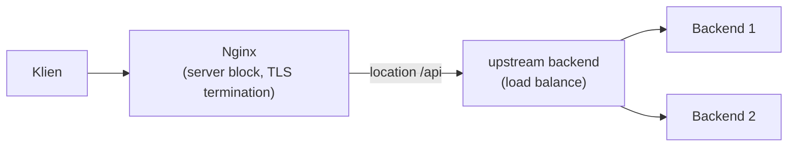

## What It Is, In One Paragraph

Nginx adalah web server dan reverse proxy performa tinggi yang dipakai luas baik untuk menyajikan konten statis langsung maupun sebagai lapisan di depan aplikasi backend — meneruskan request, menyeimbangkan beban ke banyak instance, dan menangani TLS termination sebelum traffic sampai ke aplikasi.

## The Concept It Implements

Nginx adalah implementasi utama [[../30 APIs and Web/Load Balancing and Reverse Proxies|Load Balancing and Reverse Proxies]] — pola reverse proxy dan load balancing yang dibahas abstrak di domain APIs diwujudkan konkret lewat konfigurasi Nginx sehari-hari.

## Mental Model

Tiga blok konfigurasi inti: **server block** (mendefinisikan satu virtual host, mendengarkan port dan domain tertentu); **location block** (aturan routing di dalam server block, menentukan bagaimana path tertentu ditangani — diteruskan ke backend, disajikan sebagai file statis, atau di-redirect); **upstream block** (kumpulan server backend untuk load balancing, dengan strategi distribusi yang bisa dikonfigurasi).



## The 20% You Actually Use

```nginx
upstream backend {
    server 127.0.0.1:8081;
    server 127.0.0.1:8082;
}

server {
    listen 443 ssl;
    server_name app.instansi.go.id;

    ssl_certificate /etc/nginx/ssl/cert.pem;
    ssl_certificate_key /etc/nginx/ssl/key.pem;

    location /api/ {
        proxy_pass http://backend;
        proxy_set_header X-Real-IP $remote_addr;
        proxy_set_header Host $host;
    }

    location /static/ {
        root /var/www;
    }
}
```

## Configuration That Bites

Lupa menyertakan `proxy_set_header X-Real-IP` atau `X-Forwarded-For` berarti aplikasi backend melihat semua request datang dari alamat IP Nginx itu sendiri, bukan IP klien asli — merusak logging, rate limiting berbasis IP, dan audit trail yang bergantung pada IP asli pengguna. Timeout default Nginx untuk proxy (`proxy_read_timeout`) sering tidak sesuai kebutuhan aplikasi yang punya endpoint dengan waktu proses lebih lama dari default — request yang sebenarnya masih diproses backend bisa terputus prematur oleh Nginx.

## Operating and Debugging It

`nginx -t` menguji validitas file konfigurasi sebelum reload, mencegah konfigurasi salah membuat Nginx gagal start atau reload. Access log dan error log (lokasi default bervariasi antar instalasi) adalah sumber pertama diagnosis — error log khususnya menunjukkan masalah koneksi ke upstream (backend down, timeout) yang sering jadi penyebab error 502/504 yang terlihat pengguna.

## Choosing It

Dibanding HAProxy: Nginx lebih serbaguna (bisa jadi web server penuh, bukan cuma load balancer), HAProxy secara historis lebih fokus dan sedikit lebih cepat murni untuk load balancing. Dibanding load balancer terkelola cloud (ALB, dsb): Nginx memberi kontrol penuh dan bisa dijalankan di mana saja, load balancer cloud terkelola mengurangi beban operasional tapi mengunci ke satu vendor cloud tertentu.

## Gotchas

> [!warning] Jebakan
> Lupa menyertakan header `X-Real-IP`/`X-Forwarded-For` saat proxy — aplikasi backend kehilangan informasi IP klien asli, merusak logging dan fitur yang bergantung padanya.

> [!warning] Jebakan
> Menyimpan sertifikat TLS dan private key dengan permission file yang terlalu terbuka — private key yang bisa dibaca proses lain di server yang sama adalah risiko keamanan langsung.

## Version Caveat

Sintaks konfigurasi Nginx relatif stabil antar versi, tapi fitur baru (seperti dukungan HTTP/3) hanya tersedia di versi yang cukup baru — dokumentasi resmi nginx.org adalah sumber kebenaran untuk versi yang benar-benar dipakai.

## Connected Notes

- [[../30 APIs and Web/Load Balancing and Reverse Proxies|Load Balancing and Reverse Proxies]] — konsep yang diimplementasikan konkret oleh Nginx.
- [[../10 Foundations/The TLS Handshake|The TLS Handshake]] — TLS termination di Nginx adalah titik implementasi praktis dari handshake yang dibahas di note itu.
- [[../60 Distributed Systems/The Strangler Fig Pattern|The Strangler Fig Pattern]] — Nginx sering dipakai sebagai routing layer dalam migrasi bertahap gaya strangler fig.

## Catatan Saya

*Kosong — diisi pembaca.*
