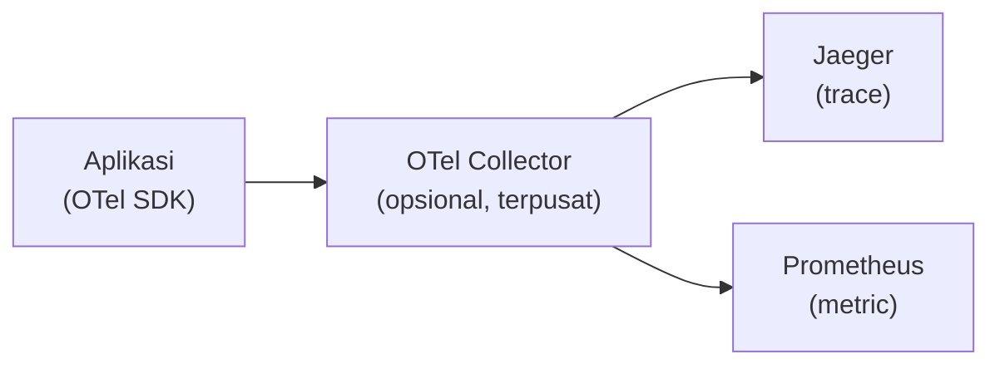

## What It Is, In One Paragraph

OpenTelemetry (sering disingkat OTel) adalah standar dan SDK vendor-netral untuk instrumentasi observability — satu set API dan konvensi yang menghasilkan trace, metric, dan log dari kode yang sama, tanpa mengunci aplikasi ke satu vendor backend tertentu (data yang dihasilkan bisa dikirim ke Jaeger, Prometheus, atau vendor komersial mana pun yang kompatibel).

## The Concept It Implements

OpenTelemetry adalah implementasi standar untuk [[../70 Infrastructure and Delivery/Distributed Tracing|Distributed Tracing]] dan [[../70 Infrastructure and Delivery/Correlation IDs|Correlation IDs]] — propagasi trace context lewat W3C Trace Context yang dibahas di note itu adalah bagian inti spesifikasi OpenTelemetry.

## Mental Model

Tiga bagian: **SDK** (library yang diintegrasikan ke kode aplikasi, menghasilkan span/metric/log); **instrumentation** (baik manual di kode sendiri, atau otomatis lewat library instrumentasi untuk framework populer); **Collector** (komponen terpisah opsional yang menerima data dari banyak aplikasi, memproses, dan meneruskannya ke backend observability pilihan — memisahkan aplikasi dari detail backend spesifik).



## The 20% You Actually Use

```go
import (
	"go.opentelemetry.io/otel"
	"go.opentelemetry.io/otel/trace"
)

var tracer = otel.Tracer("kasus-service")

func ProcessKasus(ctx context.Context, id string) error {
	ctx, span := tracer.Start(ctx, "ProcessKasus")
	defer span.End()

	span.SetAttributes(attribute.String("kasus.id", id))
	// pekerjaan di sini, meneruskan ctx yang sama ke pemanggilan berikutnya
	return nil
}
```

## Configuration That Bites

Mengaktifkan sampling 100% di production dengan traffic tinggi tanpa mempertimbangkan biaya penyimpanan trace — lihat pertimbangan sampling di [[../70 Infrastructure and Delivery/Distributed Tracing|Distributed Tracing]]; OpenTelemetry mendukung berbagai strategi sampling yang perlu dikonfigurasi eksplisit, bukan mengandalkan default yang mungkin tidak sesuai kebutuhan skala aplikasi.

## Operating and Debugging It

OTel Collector menyediakan endpoint diagnostik sendiri untuk memeriksa apakah data yang diterima benar-benar diteruskan ke backend — berguna saat trace tidak muncul di Jaeger/backend pilihan meski instrumentasi aplikasi terlihat benar.

## Choosing It

Dibanding instrumentasi vendor-specific langsung (SDK Jaeger murni, misalnya): OpenTelemetry memberi fleksibilitas berpindah backend observability tanpa menulis ulang instrumentasi aplikasi — investasi yang sepadan untuk sistem yang mungkin berganti tool observability di masa depan.

## Gotchas

> [!warning] Jebakan
> Memulai goroutine baru tanpa meneruskan `context.Context` yang membawa span aktif — memutus rangkaian trace di titik itu, persis masalah yang dibahas di [[../70 Infrastructure and Delivery/Distributed Tracing|Distributed Tracing]].

## Version Caveat

OpenTelemetry adalah proyek yang berkembang aktif (volatility tinggi) — API untuk metric dan log sempat berubah signifikan dibanding API tracing yang lebih dulu stabil; dokumentasi resmi opentelemetry.io adalah sumber kebenaran untuk versi SDK bahasa yang benar-benar dipakai.

## Connected Notes

- [[../70 Infrastructure and Delivery/Distributed Tracing|Distributed Tracing]] — konsep yang diimplementasikan standar oleh OpenTelemetry.
- [[../70 Infrastructure and Delivery/Correlation IDs|Correlation IDs]] — propagasi trace context OTel mencakup kebutuhan korelasi yang dibahas di note itu.
- [[Jaeger]] — salah satu backend paling umum menerima data trace dari OpenTelemetry.

## Catatan Saya

*Kosong — diisi pembaca.*
