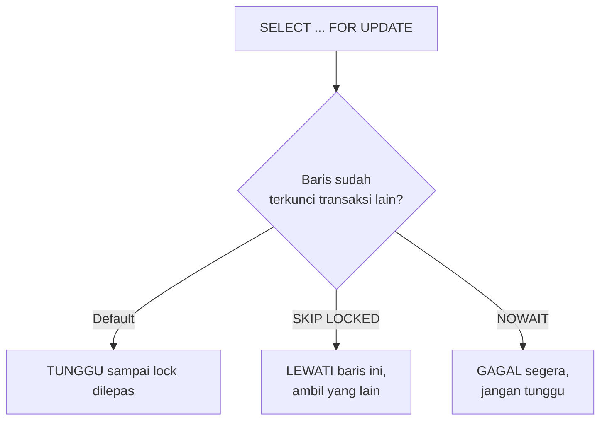

## What It Is, In One Paragraph

Sub-note ini membahas mekanisme locking eksplisit PostgreSQL — `SELECT ... FOR UPDATE`, `FOR SHARE`, `SKIP LOCKED`, `NOWAIT`, dan advisory lock — alat yang dipakai saat MVCC (yang menangani sebagian besar konkurensi secara otomatis) tidak cukup, dan aplikasi butuh secara eksplisit "mengunci" baris tertentu supaya proses konkuren lain tidak bisa mengubahnya sampai transaksi ini selesai.

## The Concept It Implements

Ini adalah implementasi konkret [[../40 Databases/Locking and Row Locks|Locking and Row Locks]] — gagasan row lock yang dibahas abstrak di domain databases diwujudkan lewat sintaks dan perilaku spesifik PostgreSQL, termasuk pola queue-in-a-database yang jadi salah satu pemakaian paling praktis dari `SKIP LOCKED`.

## Mental Model

Tiga pertanyaan yang menentukan klausa locking mana yang dipakai: **apakah baris ini akan diubah** (`FOR UPDATE` untuk exclusive lock, mencegah transaksi lain membaca-dengan-niat-mengubah baris yang sama) **atau hanya dibaca dengan jaminan tidak berubah** (`FOR SHARE`, memungkinkan pembaca lain tapi mencegah penulis)? **Apakah transaksi lain yang sudah mengunci baris ini harus ditunggu, dilewati, atau langsung gagal**? (default menunggu; `SKIP LOCKED` melewati baris yang sudah terkunci, cocok untuk worker queue; `NOWAIT` langsung gagal kalau baris terkunci, tanpa menunggu.) **Apakah lock ini terkait baris tertentu, atau butuh mengunci sesuatu yang tidak punya baris (advisory lock)**?



## The 20% You Actually Use

```sql
-- Pola queue-in-a-database: banyak worker mengambil job tanpa
-- saling menunggu atau memproses job yang sama dua kali
BEGIN;
SELECT * FROM jobs WHERE status = 'pending'
ORDER BY created_at LIMIT 1
FOR UPDATE SKIP LOCKED;
-- proses job di sini
UPDATE jobs SET status = 'done' WHERE id = $1;
COMMIT;

-- Advisory lock: mengunci "sesuatu" yang bukan baris tabel,
-- misalnya mencegah dua instance menjalankan migration bersamaan
SELECT pg_advisory_lock(12345);
-- ... kerjaan kritis ...
SELECT pg_advisory_unlock(12345);
```

```go
func ClaimNextJob(ctx context.Context, tx pgx.Tx) (Job, error) {
	var job Job
	err := tx.QueryRow(ctx, `
		SELECT id, payload FROM jobs
		WHERE status = 'pending'
		ORDER BY created_at
		LIMIT 1
		FOR UPDATE SKIP LOCKED
	`).Scan(&job.ID, &job.Payload)
	if err != nil {
		return Job{}, fmt.Errorf("claim job: %w", err)
	}
	return job, nil
}
```

## Configuration That Bites

Transaksi yang membuka `FOR UPDATE` lalu tidak segera `COMMIT`/`ROLLBACK` (misalnya karena menunggu panggilan API eksternal di tengah transaksi) menahan lock lebih lama dari yang seharusnya — praktik yang aman adalah menjaga transaksi yang memegang lock tetap pendek, memindahkan panggilan eksternal ke luar transaksi database.

## Operating and Debugging It

Untuk mendiagnosis deadlock atau transaksi yang saling menunggu, query `pg_locks` gabung dengan `pg_stat_activity` menunjukkan siapa mengunci apa dan siapa menunggu — PostgreSQL sendiri otomatis mendeteksi deadlock murni (dua transaksi saling menunggu satu sama lain) dan membatalkan salah satunya, tapi transaksi yang menunggu lock lama tanpa deadlock murni (satu transaksi memegang lock lama, yang lain menunggu tanpa batas) tidak terdeteksi otomatis dan butuh diagnosis manual.

## Choosing It

Dibanding mengandalkan optimistic locking (lihat [[../99 Glossary/Term - Optimistic Locking|Term - Optimistic Locking]]) untuk kasus konflik yang jarang terjadi: `SELECT FOR UPDATE` (pessimistic) lebih cocok untuk kasus konflik yang sering terjadi, di mana retry berulang akibat gagal optimistic lock justru lebih mahal dibanding menunggu lock sebentar. `SKIP LOCKED` dibanding message queue eksternal (Kafka, RabbitMQ) untuk kebutuhan job queue sederhana: `SKIP LOCKED` menghindari infrastruktur tambahan untuk kebutuhan skala kecil-menengah, tapi kalah dalam throughput dan fitur (delivery guarantee, dead letter queue) dibanding message queue matang untuk skala besar.

## Gotchas

> [!warning] Jebakan
> Memakai `SELECT FOR UPDATE` tanpa `SKIP LOCKED` untuk pola worker queue dengan banyak worker konkuren — worker kedua menunggu worker pertama selesai memproses baris yang sama, alih-alih langsung mengambil baris lain yang tersedia, menciptakan bottleneck yang tidak perlu.

> [!warning] Jebakan
> Lupa melepas advisory lock (`pg_advisory_unlock`) setelah selesai, terutama kalau terjadi error di tengah jalan tanpa `defer` yang menjaminnya — advisory lock yang tidak dilepas bisa memblokir proses lain yang menunggu lock yang sama sampai koneksi database itu ditutup.

## Version Caveat

`SKIP LOCKED` tersedia sejak PostgreSQL 9.5; perilaku detail advisory lock (session-level vs transaction-level) sudah stabil di versi modern tapi layak diverifikasi untuk versi yang benar-benar dipakai lewat dokumentasi resmi postgresql.org.

## Connected Notes

- [[PostgreSQL]] — note utama yang dilengkapi sub-note ini dengan mekanisme locking spesifik.
- [[../40 Databases/Locking and Row Locks|Locking and Row Locks]] — konsep abstrak row locking yang diimplementasikan konkret di note ini.
- [[../94 Case Studies/Case - The Counter That Undercounts|Case - The Counter That Undercounts]] — skenario nyata yang bisa diselesaikan dengan `SELECT FOR UPDATE` yang dibahas di note ini.
- [[../60 Distributed Systems/Quorums|Quorums]] — advisory lock pada satu instance database berbeda dari mekanisme distributed lock lintas banyak node yang dibahas di domain distributed systems.

## Catatan Saya

*Kosong — diisi pembaca.*
