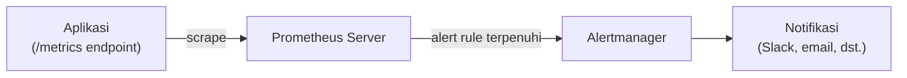

## What It Is, In One Paragraph

Prometheus adalah sistem monitoring dan alerting berbasis model pull yang jadi standar de facto di ekosistem cloud-native — aplikasi menyediakan endpoint `/metrics`, Prometheus secara berkala mengambilnya (scrape), dan hasilnya disimpan sebagai time series yang bisa diquery lewat PromQL.

## The Concept It Implements

Prometheus adalah implementasi utama [[../70 Infrastructure and Delivery/Pull vs Push Metrics Collection|Pull vs Push Metrics Collection]] — model pull yang dibahas abstrak di note itu adalah pilihan desain inti Prometheus, kontras dengan sistem berbasis push seperti StatsD.

## Mental Model

Tiga komponen inti: **exporter/instrumented app** (aplikasi yang menyediakan endpoint `/metrics` dalam format teks Prometheus); **Prometheus server** (yang men-scrape target secara berkala dan menyimpan time series); **Alertmanager** (komponen terpisah yang menerima alert dari Prometheus dan mengirim notifikasi, dengan kemampuan deduplikasi dan routing).



## The 20% You Actually Use

```yaml
# prometheus.yml — konfigurasi scrape target
scrape_configs:
  - job_name: 'my-app'
    static_configs:
      - targets: ['localhost:8080']
    scrape_interval: 15s
```

```promql
# Query dasar yang paling sering dipakai
rate(http_requests_total{status=~"5.."}[5m])
histogram_quantile(0.95, rate(http_request_duration_seconds_bucket[5m]))
```

## Configuration That Bites

Retensi data default Prometheus (biasanya beberapa hari sampai beberapa minggu tergantung konfigurasi) berarti data historis jangka panjang hilang kecuali dikonfigurasi eksplisit dengan remote storage terpisah — Prometheus sendiri tidak dirancang sebagai penyimpanan metrik jangka sangat panjang.

## Operating and Debugging It

Halaman `/targets` di UI Prometheus menunjukkan status scrape setiap target (up/down, kapan terakhir berhasil) — titik pertama diperiksa saat metrik tidak muncul seperti diharapkan. Query `up == 0` langsung menunjukkan target mana yang gagal di-scrape.

## Choosing It

Dibanding Datadog atau vendor monitoring SaaS: Prometheus open-source dan self-hosted, tanpa biaya lisensi tapi butuh effort operasional sendiri. Dibanding InfluxDB: Prometheus lebih terintegrasi dengan ekosistem Kubernetes dan lebih umum jadi pilihan default di lingkungan itu; InfluxDB punya model data time series yang sedikit berbeda dan kadang lebih cocok untuk kebutuhan IoT/sensor data volume sangat tinggi.

## Gotchas

> [!warning] Jebakan
> Mengasumsikan Prometheus cocok untuk penyimpanan metrik jangka sangat panjang tanpa remote storage tambahan — retensi bawaan terbatas, dan data lama akan hilang tanpa solusi penyimpanan jangka panjang terpisah.

## Version Caveat

Dokumentasi resmi prometheus.io adalah sumber kebenaran untuk fitur dan sintaks PromQL versi yang benar-benar dipakai.

## Connected Notes

- [[../70 Infrastructure and Delivery/Pull vs Push Metrics Collection|Pull vs Push Metrics Collection]] — model pull yang diimplementasikan konkret oleh Prometheus.
- [[../70 Infrastructure and Delivery/Query Languages for Metrics|Query Languages for Metrics]] — PromQL adalah bahasa query yang dibahas mendalam di note itu.
- [[Grafana]] — tool visualisasi yang paling umum dipasangkan dengan Prometheus sebagai sumber data.

## Catatan Saya

*Kosong — diisi pembaca.*
