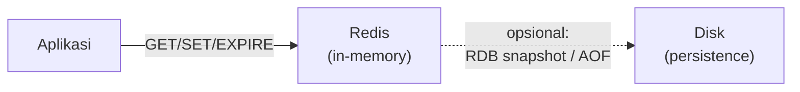

## What It Is, In One Paragraph

Redis adalah data store in-memory yang jauh lebih dari sekadar `GET`/`SET` sederhana — ia menyediakan struktur data kaya (list, hash, set, sorted set, stream) yang semuanya bisa dimanipulasi atomik lewat perintah bawaan, membuatnya berguna bukan hanya sebagai cache tapi juga sebagai building block untuk rate limiter, leaderboard, antrean sederhana, dan distributed lock (dengan catatan penting soal batasannya, dibahas di bawah).

## The Concept It Implements

Redis adalah implementasi paling umum dipakai dari [[../50 Concurrency and Performance/Cache-Aside, Write-Through, and Write-Behind|Cache-Aside, Write-Through, and Write-Behind]] — pola caching yang dibahas abstrak di domain performance diwujudkan konkret lewat perintah `GET`/`SET`/`EXPIRE` Redis sehari-hari.

## Mental Model

Empat hal untuk bernalar tentang Redis: **single-threaded per operasi** (setiap perintah dieksekusi atomik tanpa race condition internal, meski Redis modern punya thread I/O terpisah untuk jaringan — inti eksekusi perintah tetap single-threaded, yang justru jadi sumber jaminan atomicity-nya); **struktur data sebagai warga kelas satu** (bukan hanya string, tapi list/hash/set/sorted set yang masing-masing punya operasi atomik sendiri); **persistence opsional** (RDB snapshot berkala, atau AOF yang mencatat setiap perintah — keduanya trade-off durability vs performa, dan Redis tetap bisa dipakai murni sebagai cache tanpa persistence sama sekali); dan **eviction saat memori penuh** (kebijakan yang menentukan data mana dibuang duluan kalau memori habis).



## The 20% You Actually Use

```
SET session:abc123 "user_data" EX 3600   -- cache dengan TTL
GET session:abc123
SETNX lock:job:42 "worker-1" EX 30       -- lock sederhana (lihat batasan di bawah)
HSET user:1 nama "Budi" email "budi@x.id" -- hash untuk objek terstruktur
ZADD leaderboard 100 "user1" 95 "user2"  -- sorted set untuk ranking
```

```go
import "github.com/redis/go-redis/v9"

client := redis.NewClient(&redis.Options{Addr: "localhost:6379"})

// Cache-aside: cek cache dulu, kalau miss ambil dari DB lalu simpan
val, err := client.Get(ctx, "kasus:123").Result()
if err == redis.Nil {
	val = fetchFromDatabase(ctx, "123")
	client.Set(ctx, "kasus:123", val, 5*time.Minute)
} else if err != nil {
	return fmt.Errorf("redis get: %w", err)
}
```

## Configuration That Bites

`maxmemory-policy` default sering `noeviction` — begitu memori penuh, Redis **menolak** tulisan baru alih-alih membuang data lama, yang mengejutkan tim yang mengharapkan perilaku cache biasa (LRU otomatis). Untuk pemakaian sebagai cache murni, `allkeys-lru` atau `allkeys-lfu` biasanya lebih sesuai — kebijakan `noeviction` lebih cocok kalau Redis dipakai sebagai penyimpanan data yang benar-benar tidak boleh hilang.

## Operating and Debugging It

`INFO memory` menunjukkan pemakaian memori aktual; `SLOWLOG GET` menampilkan perintah yang lambat dieksekusi — berguna mendiagnosis operasi yang tidak seharusnya lambat di sistem in-memory (biasanya perintah dengan kompleksitas O(N) seperti `KEYS *` yang dijalankan pada dataset besar, alih-alih `SCAN` yang lebih aman untuk production).

## Choosing It

Dibanding Memcached: Redis menang di struktur data kaya dan persistence opsional; Memcached lebih sederhana dan kadang sedikit lebih cepat untuk kasus cache murni string sederhana. Dibanding memakai database utama sebagai "cache" (misalnya query MariaDB yang di-cache di level aplikasi tanpa Redis): Redis memberi latency jauh lebih rendah dan tidak membebani database utama untuk beban baca berulang.

## Gotchas

> [!warning] Jebakan
> Memakai `SETNX` sebagai distributed lock tanpa memahami batasannya — lock sederhana ini rentan masalah kalau node Redis yang memegangnya gagal (lihat pertimbangan mendalam di [[../50 Concurrency and Performance/Distributed Locks and Why They Are Dangerous|Distributed Locks and Why They Are Dangerous]]), jangan dipakai untuk kebutuhan yang benar-benar kritis tanpa mekanisme tambahan.

> [!warning] Jebakan
> Menjalankan `KEYS *` di production untuk mencari key dengan pola tertentu — memblokir Redis (yang single-threaded untuk eksekusi perintah) selama operasi berjalan pada dataset besar; pakai `SCAN` yang iteratif dan tidak memblokir.

## Version Caveat

Redis Cluster dan mode sentinel (high availability) punya perilaku dan batasan tersendiri yang tidak dibahas mendalam di note ini — dokumentasi resmi redis.io adalah sumber kebenaran untuk versi yang benar-benar dipakai, terutama untuk fitur yang berubah cukup sering (streams, functions).

## Connected Notes

- [[../50 Concurrency and Performance/Cache-Aside, Write-Through, and Write-Behind|Cache-Aside, Write-Through, and Write-Behind]] — pola caching yang diimplementasikan konkret lewat Redis di note ini.
- [[../50 Concurrency and Performance/Distributed Locks and Why They Are Dangerous|Distributed Locks and Why They Are Dangerous]] — batasan `SETNX` sebagai lock dibahas mendalam di note itu.
- [[../60 Distributed Systems/CQRS]] — Redis sering dipakai sebagai read model performa tinggi dalam pola CQRS.
- [[../60 Distributed Systems/Consistent Hashing|Consistent Hashing]] — Redis Cluster mengimplementasikan varian consistent hashing untuk mendistribusikan data.

## Catatan Saya

*Kosong — diisi pembaca.*
