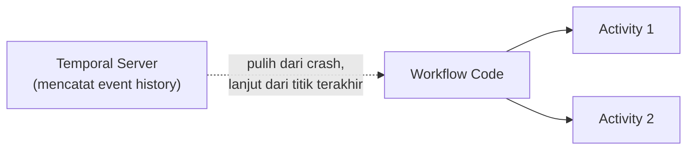

## What It Is, In One Paragraph

Temporal adalah platform durable execution — menjalankan kode workflow yang bisa berjalan selama berhari-hari atau berbulan-bulan, otomatis melanjutkan dari titik terakhir kalau proses yang menjalankannya crash, tanpa developer harus menulis sendiri logika penyimpanan state dan pemulihan yang rumit.

## The Concept It Implements

Temporal adalah implementasi durable-execution untuk [[../60 Distributed Systems/Sagas - Orchestration vs Choreography|Sagas - Orchestration vs Choreography]] — pola orchestration saga yang dibahas abstrak di note itu, termasuk compensating action, punya dukungan langsung sebagai primitif bahasa di Temporal SDK, bukan harus dibangun manual dari nol.

## Kapan Ini Dipakai

Temporal paling bernilai untuk proses bisnis panjang dan kompleks yang melibatkan banyak langkah, retry, dan kemungkinan kompensasi — persis kebutuhan saga di sistem terdistribusi. Untuk proses sederhana dengan sedikit langkah yang bisa ditangani state machine biasa di database, Temporal adalah infrastruktur tambahan yang mungkin berlebihan.

## Mental Model Singkat

Kode **workflow** mendefinisikan urutan logika (bisa memanggil **activity** — unit kerja yang benar-benar berinteraksi dengan dunia luar, API, database). Temporal server mencatat setiap kejadian dalam eksekusi sebagai event history — kalau proses worker yang menjalankan workflow itu mati, worker lain (atau yang sama setelah restart) melanjutkan persis dari titik terakhir berdasarkan event history itu, bukan mulai dari awal.



## Contoh Konkret

```go
func PengajuanWorkflow(ctx workflow.Context, kasusID string) error {
	err := workflow.ExecuteActivity(ctx, KunciKuota, kasusID).Get(ctx, nil)
	if err != nil {
		return err
	}
	err = workflow.ExecuteActivity(ctx, VerifikasiDokumen, kasusID).Get(ctx, nil)
	if err != nil {
		// Temporal otomatis menjalankan compensating activity
		// yang didefinisikan, tanpa logika manual rumit
		workflow.ExecuteActivity(ctx, LepasKuota, kasusID)
		return err
	}
	return nil
}
```

## Kapan Memilih Ini vs Alternatif

Pilih Temporal untuk saga kompleks dengan banyak langkah dan kebutuhan durability tinggi terhadap kegagalan proses. Untuk saga sederhana, mengimplementasikan orchestrator manual (seperti contoh di [[../60 Distributed Systems/Sagas - Orchestration vs Choreography|Sagas - Orchestration vs Choreography]]) mungkin cukup tanpa infrastruktur Temporal tambahan yang harus dioperasikan.

> [!warning] Jebakan
> Menulis kode activity yang tidak idempoten — activity di Temporal bisa dijalankan ulang otomatis saat pemulihan dari kegagalan, dan activity yang tidak idempoten menghasilkan efek samping ganda persis masalah yang dibahas di [[../60 Distributed Systems/Idempotency Keys|Idempotency Keys]].

## Version Caveat

Temporal adalah proyek yang berkembang cukup aktif — dokumentasi resmi temporal.io adalah sumber kebenaran untuk fitur SDK bahasa yang benar-benar dipakai.

## Connected Notes

- [[../60 Distributed Systems/Sagas - Orchestration vs Choreography|Sagas - Orchestration vs Choreography]] — konsep yang diimplementasikan langsung sebagai primitif bahasa di Temporal.
- [[../60 Distributed Systems/Idempotency Keys|Idempotency Keys]] — kebutuhan idempotency yang tetap berlaku untuk activity Temporal.
- [[../60 Distributed Systems/Compensating Transactions|Compensating Transactions]] — compensating action yang didukung langsung sebagai pola di Temporal SDK.

## Catatan Saya

*Kosong — diisi pembaca.*
