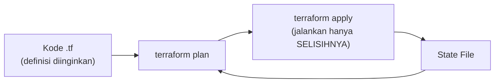

## What It Is, In One Paragraph

Terraform adalah tool infrastructure-as-code paling luas dipakai untuk mengelola resource cloud (VM, database, jaringan) secara declarative — mendefinisikan keadaan infrastruktur yang diinginkan dalam file konfigurasi, dan Terraform menghitung serta menjalankan langkah yang diperlukan untuk mencapainya.

## The Concept It Implements

Terraform adalah implementasi utama [[../70 Infrastructure and Delivery/Declarative vs Imperative Infrastructure|Declarative vs Imperative Infrastructure]] — mekanisme state file dan diff yang dibahas abstrak di [[../70 Infrastructure and Delivery/State Files and Drift|State Files and Drift]] adalah inti cara kerja Terraform.

## Mental Model

Tiga bagian: **provider** (plugin yang tahu cara berbicara dengan platform tertentu — AWS, GCP, Kubernetes, bahkan GitHub); **resource** (satu unit infrastruktur yang didefinisikan — VM, subnet, database); **state** (catatan Terraform tentang resource yang sudah ia buat, dipakai menghitung selisih dengan definisi terbaru).



## The 20% You Actually Use

```hcl
resource "aws_instance" "app_server" {
  ami           = "ami-xxxxx"
  instance_type = "t3.medium"
  tags = {
    Name = "app-server-1"
  }
}
```

```bash
terraform init      # inisialisasi provider dan backend state
terraform plan       # lihat perubahan yang AKAN dilakukan, tanpa eksekusi
terraform apply       # jalankan perubahan
terraform import aws_instance.app_server i-xxxxx  # adopsi resource yang sudah ada
```

## Configuration That Bites

Menyimpan state file secara lokal (default kalau tidak dikonfigurasi) alih-alih remote backend (S3 dengan locking, atau Terraform Cloud) berisiko kehilangan state atau konflik kalau lebih dari satu orang menjalankan `apply` bersamaan — lihat konsekuensinya di [[../70 Infrastructure and Delivery/State Files and Drift|State Files and Drift]].

## Operating and Debugging It

`terraform plan` sebelum `apply` adalah kebiasaan wajib — selalu tinjau apa yang akan berubah sebelum benar-benar dieksekusi, terutama memeriksa apakah ada resource yang akan **dihapus** secara tak terduga (tanda drift atau kesalahan definisi).

## Choosing It

Dibanding [[Ansible]] untuk provisioning infrastruktur cloud: Terraform lebih cocok untuk mendefinisikan dan mengelola siklus hidup resource cloud (create/update/destroy); Ansible lebih cocok untuk konfigurasi di dalam mesin yang sudah ada. Keduanya sering dipakai bersamaan — Terraform menyediakan VM, Ansible mengonfigurasinya.

## Gotchas

> [!warning] Jebakan
> Mengubah resource yang dikelola Terraform secara manual lewat console cloud — menciptakan drift yang akan tertimpa (atau memicu konflik) di `apply` berikutnya, seperti dibahas di [[../70 Infrastructure and Delivery/State Files and Drift|State Files and Drift]].

## Version Caveat

Sintaks HCL (HashiCorp Configuration Language) relatif stabil, tapi provider individual (terutama provider cloud besar) sering menambah/mengubah argumen resource antar versi — dokumentasi resmi registry.terraform.io untuk provider yang benar-benar dipakai adalah sumber kebenaran.

## Connected Notes

- [[../70 Infrastructure and Delivery/Declarative vs Imperative Infrastructure|Declarative vs Imperative Infrastructure]] — filosofi declarative yang diimplementasikan konkret oleh Terraform.
- [[../70 Infrastructure and Delivery/State Files and Drift|State Files and Drift]] — mekanisme state file yang jadi inti cara kerja Terraform.
- [[Ansible]] — tool configuration management yang sering dipasangkan dengan Terraform untuk kebutuhan berbeda.
- [[ArgoCD]] — pendekatan GitOps alternatif yang menerapkan filosofi declarative serupa khusus untuk Kubernetes.

## Catatan Saya

*Kosong — diisi pembaca.*
