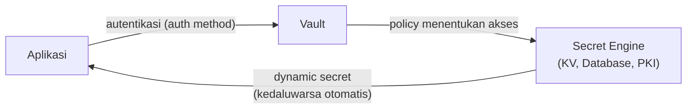

## What It Is, In One Paragraph

Vault (HashiCorp) adalah tool pengelolaan secret terpusat — menyimpan kredensial, kunci enkripsi, dan sertifikat secara aman, dengan kemampuan menerbitkan credential **sementara** (dynamic secret) yang otomatis kedaluwarsa, alih-alih hanya menyimpan secret statis yang harus dirotasi manual.

## The Concept It Implements

Vault adalah implementasi utama [[../80 Security/Secret Management|Secret Management]] dan [[../80 Security/Key Management and Rotation|Key Management and Rotation]] — siklus hidup kunci (generate, distribute, rotate, revoke) yang dibahas abstrak di kedua note itu diwujudkan konkret sebagai fitur inti Vault.

## Kapan Ini Dipakai

Vault paling bernilai begitu jumlah secret dan kredensial yang dikelola melampaui apa yang bisa ditangani aman lewat environment variable atau file konfigurasi manual — terutama untuk kebutuhan yang butuh rotasi otomatis (kredensial database, sertifikat mTLS) atau audit trail siapa mengakses secret apa dan kapan. Untuk sistem kecil dengan sedikit secret yang jarang berubah, Vault mungkin overhead operasional yang tidak sepadan dibanding pengelolaan manual yang lebih sederhana.

## Mental Model Singkat

Tiga bagian: **secret engine** (plugin yang menentukan jenis secret yang dikelola — KV statis, database dynamic secret, PKI untuk sertifikat); **auth method** (cara aplikasi/pengguna membuktikan identitas ke Vault sebelum diberi akses — token, Kubernetes service account, dan lainnya); **policy** (aturan yang menentukan secret mana yang boleh diakses identitas tertentu, menerapkan least privilege).



## Contoh Konkret

```bash
vault kv put secret/kasus-service db_password="s3cret"
vault kv get secret/kasus-service

# Dynamic secret: kredensial database yang otomatis kedaluwarsa
vault read database/creds/kasus-role
```

## Kapan Memilih Ini vs Alternatif

Pilih Vault untuk kebutuhan rotasi otomatis dan audit trail akses secret yang matang. Untuk kebutuhan lebih sederhana di ekosistem Kubernetes murni, Kubernetes Secrets (lihat [[../70 Infrastructure and Delivery/Kubernetes Config, Secrets, Probes, and Autoscaling|Kubernetes Config, Secrets, Probes, and Autoscaling]]) mungkin cukup, meski dengan jaminan keamanan yang lebih lemah tanpa konfigurasi tambahan.

> [!warning] Jebakan
> Menyimpan secret di Vault tapi tetap mengizinkan akses luas tanpa policy least privilege yang ketat — Vault hanya sekuat kebijakan akses yang benar-benar ditegakkan di dalamnya.

## Version Caveat

Dokumentasi resmi vaultproject.io adalah sumber kebenaran untuk secret engine dan auth method yang benar-benar dipakai untuk versi tertentu.

## Connected Notes

- [[../80 Security/Secret Management|Secret Management]] — konsep yang diimplementasikan konkret oleh Vault.
- [[../80 Security/Key Management and Rotation|Key Management and Rotation]] — siklus hidup kunci yang jadi fitur inti Vault.
- [[../70 Infrastructure and Delivery/Kubernetes Config, Secrets, Probes, and Autoscaling|Kubernetes Config, Secrets, Probes, and Autoscaling]] — alternatif lebih sederhana (dan lebih lemah) untuk kebutuhan sejenis di Kubernetes murni.

## Catatan Saya

*Kosong — diisi pembaca.*
