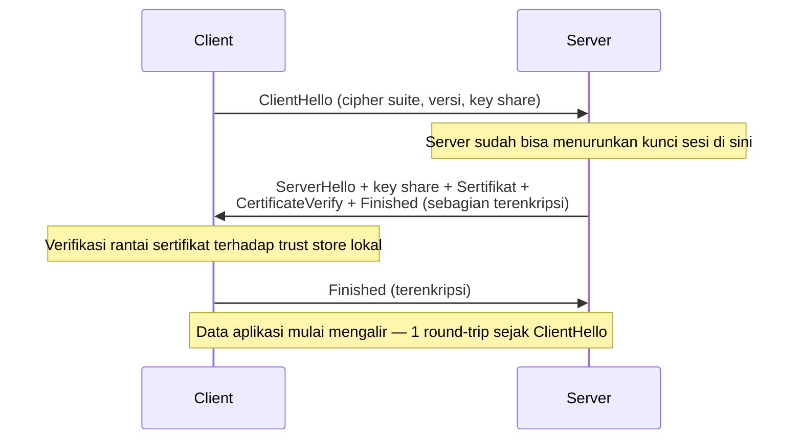

# REVISI — Temuan Review dan Instruksi Perbaikan

> **Untuk Sonnet 5 (eksekutor).** Dokumen ini adalah hasil review, bukan hasil perbaikan.
> Tugasmu: kerjakan perbaikan di file note yang disebut, lalu centang checkbox-nya di sini.
> Reviewer tidak mengubah satu pun note — semua perubahan dilakukan olehmu.
>
> **Urutan pengerjaan:** Bagian A (salah konsep) → Bagian B (bug kode) → Bagian C
> (kontradiksi antar-note) → Bagian D (bahasa, seluruh vault) → Bagian E (protokol untuk
> note yang belum diaudit) → Bagian F (kebersihan link).
>
> Bagian A–C dan F adalah daftar tertutup: kerjakan persis yang tertulis.
> Bagian D dan E adalah aturan yang berlaku ke **seluruh** vault.

---

## 0. Cakupan review ini — baca dulu sebelum mulai

Vault ini berisi **199 note (± 325.000 kata)**. Review ini terdiri dari dua lapis dengan
tingkat kedalaman berbeda, dan kamu perlu tahu bedanya supaya tidak salah asumsi:

**Lapis 1 — dibaca kalimat per kalimat (31 note).** Temuan konkret di Bagian A, B, C
berasal dari note-note ini:

| Domain | Note yang diaudit penuh |
|---|---|
| `10 Foundations` | **seluruh 12 note** |
| `20 Go Language` | Slice Internals · Map Internals · Defer, Panic, and Recover · Interfaces and Implicit Satisfaction |
| `40 Databases` | Basic Isolation Levels · Isolation Levels and Their Anomalies · MVCC · Locking and Row Locks · Composite Indexes and the Leftmost-Prefix Rule |
| `50 Concurrency` | Goroutine Scheduler (GMP) · Garbage Collection in Go · The Go Memory Model · Distributed Locks and Why They Are Dangerous |
| `30 APIs and Web` | Idempotency · Webhooks and How to Secure Them |
| `80 Security` | JWT · Password Hashing · CSRF |
| `90 Architecture` | Hexagonal and Clean Architecture in Go |

**Lapis 2 — dianalisis secara terukur di seluruh 199 note.** Statistik gaya bahasa,
integritas wikilink, pola idiom Go usang, dan klaim berangka — hasilnya ada di Bagian D
dan F, dan **berlaku untuk semua note**, termasuk yang tidak masuk daftar di atas.

**Konsekuensinya:** 168 note belum diperiksa kalimat per kalimat. Jangan
menyimpulkan note yang tidak disebut di Bagian A–C berarti bersih. Bagian E berisi
protokol audit yang harus kamu jalankan sendiri pada note-note itu.

**Penilaian umum.** Kualitas vault ini tinggi. Sebagian besar temuan di bawah adalah
koreksi presisi, bukan pembongkaran. Tapi tiga temuan (A-1, A-2, A-6) mengajarkan model
mental yang **salah**, dan itu kategori kegagalan paling berbahaya menurut `CLAUDE.md`
§16.1 — perbaiki lebih dulu.

---

## A. Salah konsep — perbaiki lebih dulu

### A-1 · `10 Foundations/TCP Handshake and Connection Lifecycle.md` — contoh "naif" tidak memicu bug yang diajarkan

**Lokasi:** bagian `## In Go`, fungsi `callPartnerNaif`.

```go
client := &http.Client{Timeout: 5 * time.Second}   // <- klaim: koneksi baru tiap panggilan
```

**Kenapa salah:** `http.Client` dengan field `Transport` **nil** tidak membuat transport
baru — ia jatuh ke `http.DefaultTransport`, yaitu variabel level-package yang **dibagikan
seluruh aplikasi** dan punya idle connection pool sendiri. Jadi kode "naif" ini
sebenarnya **tetap** memakai ulang koneksi. Pembaca yang mempercayai note ini akan
mengira dirinya aman selama tidak menyalin pola tersebut, padahal pola yang sungguh
berbahaya (membuat `&http.Transport{}` baru) tidak pernah ditunjukkan.

**Perbaikan:** ganti contoh naif menjadi transport baru per panggilan, dan tambahkan satu
kalimat penjelas.

```go
// Naif: Transport BARU dibuat setiap panggilan. Setiap Transport punya
// connection pool sendiri, jadi tidak ada koneksi yang bisa dipakai ulang —
// koneksi TCP dibuka lalu ditutup terus-menerus, dan TIME_WAIT menumpuk.
func callPartnerNaif(ctx context.Context, url string) ([]byte, error) {
    client := &http.Client{
        Timeout:   5 * time.Second,
        Transport: &http.Transport{}, // <- inilah sumber masalahnya
    }
    // ...
}
```

Tambahkan tepat di bawah contoh:

> `&http.Client{}` tanpa field `Transport` sebenarnya memakai `http.DefaultTransport`
> yang dibagikan seluruh aplikasi, jadi ia **tetap** memakai ulang koneksi. Yang benar-benar
> mematikan connection reuse adalah membuat `http.Transport` baru — dan itu justru sering
> dilakukan tanpa sadar, misalnya saat seseorang menyalin kode yang menyetel
> `TLSClientConfig` atau proxy ke dalam sebuah helper function.

- [x] Dikerjakan

---

### A-2 · `50 Concurrency and Performance/Goroutine Scheduler (GMP).md` — jumlah M dinyatakan dibatasi jumlah core

**Lokasi:** bagian `## Intuition`.

> **M** (OS thread) adalah pegawai sungguhan yang benar-benar mengerjakan tugas —
> jumlahnya dibatasi oleh berapa banyak "kursi fisik" yang bisa dipakai bekerja bersamaan
> (mendekati jumlah core CPU).

**Kenapa salah:** yang dibatasi mendekati jumlah core adalah **P**, lewat `GOMAXPROCS`.
Jumlah **M** tidak dibatasi jumlah core sama sekali — runtime Go membuat M tambahan
setiap kali sebuah goroutine masuk ke syscall yang memblokir, dan batas atasnya adalah
angka yang jauh lebih besar (diatur lewat `runtime/debug.SetMaxThreads`, defaultnya di
orde ribuan). Sebuah program Go yang banyak melakukan blocking syscall bisa punya
ratusan M di atas 4 core.

Note ini bahkan **membantah dirinya sendiri** 23 baris kemudian, di bagian
`## How It Works`: *"Go runtime melepaskan M itu dari P-nya ... dan memasang M lain
(atau **membuat M baru**) ke P itu."* Kalau jumlah M dibatasi jumlah core, kalimat itu
tidak mungkin benar.

**Perbaikan:** tulis ulang paragraf Intuition supaya batas melekat pada P, bukan M.

> **M** (OS thread) adalah pegawai sungguhan yang benar-benar mengerjakan tugas.
> Jumlah M **tidak** dibatasi jumlah core — runtime menambah pegawai baru setiap kali
> ada pegawai lama yang tersangkut menunggu sesuatu di luar kantor (syscall yang
> memblokir). Yang dibatasi adalah jumlah **meja kerja (P)**, dan itu yang menentukan
> berapa banyak pegawai bisa benar-benar bekerja pada satu waktu: pegawai tanpa meja
> tidak mengerjakan apa pun. Jumlah meja diatur `GOMAXPROCS`, biasanya mendekati jumlah
> core CPU.

Tambahkan juga satu baris di `## Under The Hood`:

> Jumlah M bisa jauh melebihi jumlah P. Setiap M yang sedang tersangkut di blocking
> syscall tidak memegang P, jadi ia tidak memakan kuota paralelisme — ia hanya memakan
> memori stack thread. Ini kenapa program yang banyak memanggil cgo atau operasi file
> blocking bisa punya jumlah OS thread yang mengejutkan tingginya, tanpa itu berarti ada
> bug.

Perbaiki juga diagram Mermaid: panah `P1 --> CPU1` menyiratkan P berjalan langsung di
core. Yang berjalan di core adalah M. Ubah menjadi `M1 --> CPU1` dan `M1 --> P1`
(M memegang P, M dieksekusi core).

- [x] Dikerjakan

---

### A-3 · `10 Foundations/The TCP-IP Model.md` — analogi "amplop di dalam amplop" terbalik

**Lokasi:** bagian `## Intuition`.

> Amplop **terluar** hanya berisi alamat pengiriman antar-negara (analog dengan Internet
> layer — IP, routing lintas jaringan). **Di dalamnya** ada amplop yang menyebut kurir mana
> dan rute lokal mana yang harus dipakai (Link layer).

**Kenapa salah:** encapsulation bekerja sebaliknya. Data aplikasi ada di lapisan paling
dalam; setiap lapisan **di bawahnya** membungkus dari luar. Header Link layer (Ethernet)
adalah yang **paling luar** — itu yang pertama dibaca dan dilepas router di setiap hop.
Analogi ini mengajarkan urutan encapsulation yang terbalik, padahal urutan itulah inti
dari seluruh note.

**Perbaikan:** balik urutannya.

> Bayangkan mengirim surat lewat pos internasional sebagai **amplop di dalam amplop**.
> Isi surat yang sebenarnya — pesan yang ingin kamu sampaikan — ada di paling dalam
> (Application layer, misalnya HTTP). Ia dimasukkan ke amplop yang menyatakan "ini surat
> tercatat, harus dikonfirmasi diterima" (Transport layer — TCP atau UDP). Amplop itu
> dimasukkan lagi ke amplop yang menulis alamat lengkap negara tujuan (Internet layer —
> IP). Dan amplop itu, terakhir, dimasukkan ke kantong kurir yang hanya tahu rute dari
> kantor pos ini ke kantor pos berikutnya (Link layer — Ethernet atau WiFi).
>
> Urutan ini penting dan sering dibalik orang: yang **paling luar** adalah lapisan yang
> **paling dekat kabel**, bukan yang paling dekat aplikasi. Itu sebabnya router di
> tengah jalan cukup membuka satu lapis terluar untuk tahu ke mana meneruskan paket —
> ia tidak pernah perlu membuka isi surat.

Kalimat "Analogi ini bocor..." yang sudah ada boleh tetap dipertahankan sesudahnya.

- [x] Dikerjakan

---

### A-4 · `10 Foundations/The TLS Handshake.md` — urutan pesan di diagram adalah bentuk TLS 1.2, bukan 1.3

**Lokasi:** diagram Mermaid di `## How It Works`, yang berjudul "Handshake TLS modern
(versi 1.3)".

Diagram menunjukkan: ClientHello → ServerHello+Sertifikat → *client menyelesaikan
pertukaran kunci* → **Server Finished** → Client Finished.

**Kenapa salah:** di TLS 1.3, server mengirim `Finished` dalam **flight yang sama**
dengan `ServerHello`, `Certificate`, dan `CertificateVerify` — bukan setelah menunggu
langkah tambahan dari client. Client mengirim key share-nya sudah di `ClientHello`.
Urutan yang digambarkan adalah bentuk TLS 1.2, dan ini merusak klaim note itu sendiri
bahwa TLS 1.3 mengurangi jumlah round-trip: dengan urutan yang digambar, jumlah
round-trip-nya sama saja.

**Perbaikan:** ganti diagram.



Tambahkan di bawah diagram:

> Perhatikan bahwa client sudah mengirim key share-nya di `ClientHello`, dan server
> membalas seluruh sisanya dalam satu kiriman. Inilah alasan mekanis kenapa TLS 1.3
> butuh lebih sedikit round-trip dibanding TLS 1.2, yang mengharuskan pertukaran kunci
> berlangsung dalam kiriman terpisah setelah sertifikat diterima.

- [x] Dikerjakan

---

### A-5 · `10 Foundations/How An OS Handles Network Connections.md` — perilaku default saat accept queue penuh

**Lokasi:** `## TL;DR`, `## The Problem`, diagram, dan `## Intuition` — klaimnya berulang
di empat tempat.

> koneksi baru bisa **ditolak atau di-reset**

**Kenapa kurang tepat:** di Linux dengan setelan default (`net.ipv4.tcp_abort_on_overflow
= 0`), kernel **membuang SYN secara diam-diam** saat accept queue penuh — bukan mengirim
RST. Client tidak menerima error; ia mengalami **timeout lalu retransmisi SYN**. Ini
penting karena mengubah gejala yang harus dicari saat diagnosis: bukan "connection
reset", melainkan "koneksi terasa lambat lalu timeout", dan itu jauh lebih mudah salah
didiagnosis sebagai server lambat.

**Perbaikan:** ganti frasa itu di keempat tempat, dan tambahkan paragraf ini di
`## Under The Hood`:

> Apa yang persis terjadi saat accept queue penuh bergantung pada setelan kernel. Di
> Linux, perilaku default adalah **membuang paket SYN itu diam-diam**, bukan mengirim
> `RST`. Akibatnya client tidak melihat penolakan yang jelas — ia hanya "menunggu",
> mengirim ulang SYM-nya beberapa kali sesuai aturan retransmisi TCP, lalu akhirnya
> timeout. Gejala di sisi client karena itu terlihat seperti **server yang lambat**,
> bukan server yang menolak. Ini jebakan diagnosis yang serius: tim mencari query
> lambat atau handler berat, padahal request-nya belum pernah sampai ke aplikasi sama
> sekali. Metrik yang menjawab pertanyaan ini adalah penghitung overflow di
> `netstat -s` (baris yang menyebut *listen queue* / *SYNs to LISTEN sockets dropped*),
> bukan metrik aplikasi mana pun.

Perbaiki juga analogi di `## Intuition` — kalimat "surat baru dikembalikan ke pengirim"
harus jadi "surat baru dibuang tanpa pemberitahuan, dan pengirim hanya tahu bahwa
balasannya tak kunjung datang".

Sekalian tambahkan pembedaan yang hilang di `## How It Works` (satu kalimat, sesudah
langkah 4):

> Sebenarnya ada **dua** antrean, bukan satu: *SYN queue* menampung koneksi yang
> handshake-nya belum selesai, dan *accept queue* menampung yang sudah selesai tapi
> belum diambil `accept()`. Keduanya punya batas sendiri dan bisa penuh sendiri-sendiri.

- [x] Dikerjakan

---

### A-6 · `50 Concurrency and Performance/Garbage Collection in Go.md` — `GOMEMLIMIT` disebut batas keras

**Lokasi:** `## Under The Hood`.

> ia menetapkan **batas absolut** memori ... `GOMEMLIMIT` sebagai **batas keras** untuk
> mencegah OOM kill

**Kenapa salah:** `GOMEMLIMIT` adalah **soft limit**, dan ini dinyatakan eksplisit di
dokumentasi Go. Runtime akan bekerja makin agresif saat mendekatinya, tapi ia **akan
melampauinya** daripada mengorbankan progres program — karena sebagian memori proses
(stack goroutine, memori yang dipegang cgo, mapping OS) berada di luar kendali GC. Note
ini menjanjikan perlindungan yang tidak diberikan `GOMEMLIMIT`, dan pembaca yang
mempercayainya akan menyetelnya persis di angka memory limit container lalu tetap kena
OOM kill tanpa mengerti kenapa.

**Perbaikan:** ganti kedua frasa, dan tambahkan jebakan baru di `## Common Mistakes`:

> `GOMEMLIMIT` adalah **batas lunak (soft limit)**, bukan batas keras. Saat pemakaian
> mendekati angka itu, GC bekerja jauh lebih agresif — tapi kalau program memang
> benar-benar butuh lebih, runtime akan melewatinya daripada membuat program macet
> total. Ia juga hanya mengatur memori yang dikelola runtime Go; memori yang dipegang
> library C lewat cgo tidak ikut terhitung.

```
> [!warning] Jebakan
> Menyetel `GOMEMLIMIT` persis sama dengan memory limit container, lalu menganggap OOM
> kill tidak mungkin terjadi lagi. `GOMEMLIMIT` adalah batas lunak dan hanya mencakup
> memori yang dikelola runtime Go — sisakan margin nyata (misalnya setel di sekitar
> 80–90% dari limit container, lalu ukur), dan tetap pantau pemakaian memori proses
> sesungguhnya, bukan hanya angka heap dari `runtime.MemStats`.
```

- [x] Dikerjakan

---

### A-7 · `40 Databases/Basic Isolation Levels.md` — sintaks SQL tidak jalan di MariaDB

**Lokasi:** blok SQL di `## How It Works`.

```sql
START TRANSACTION ISOLATION LEVEL REPEATABLE READ;
```

**Kenapa salah:** sintaks ini valid di PostgreSQL, **tidak valid di MySQL/MariaDB** —
padahal MariaDB adalah database harian pembaca, dan seluruh note ini justru dibangun di
sekitar perbedaan default antara kedua mesin itu. Pembaca yang menyalin baris ini ke
MariaDB akan langsung dapat syntax error.

**Perbaikan:** tampilkan keduanya secara eksplisit.

```sql
-- PostgreSQL
BEGIN TRANSACTION ISOLATION LEVEL REPEATABLE READ;
-- ... operasi transaction ...
COMMIT;

-- MySQL / MariaDB — isolation level diset SEBELUM transaction dimulai,
-- tidak bisa digabung ke dalam satu statement START TRANSACTION.
SET TRANSACTION ISOLATION LEVEL REPEATABLE READ;
START TRANSACTION;
-- ... operasi transaction ...
COMMIT;
```

Tambahkan satu kalimat: *"Perbedaan sintaks sekecil ini adalah contoh konkret kenapa
menyetel isolation level lewat `sql.TxOptions` di Go lebih aman daripada menuliskannya
sebagai SQL mentah — driver yang menerjemahkannya ke dialek yang benar."*

**Sekaligus perbaiki tabel di note yang sama.** Kolomnya berjudul `Biaya relatif`, tapi
dua selnya berisi `Default PostgreSQL` dan `Default MySQL/MariaDB` — itu bukan biaya.
Pecah jadi dua kolom: `Biaya relatif` dan `Default di mesin`.

- [x] Dikerjakan

---

### A-8 · `40 Databases/Isolation Levels and Their Anomalies.md` — skenario pembuka tidak ada di tabelnya sendiri

**Lokasi:** paragraf pertama `## The Problem` (dua petugas, "ditolak" menimpa
"diverifikasi").

**Kenapa bermasalah:** skenario itu adalah **lost update** — anomali yang punya nama
sendiri, dan yang **tidak muncul** di tabel empat-anomali di `## How It Works`. Pembaca
diberi cerita pembuka lalu tidak pernah diberi tahu nama masalahnya atau isolation level
mana yang mencegahnya. Lebih buruk lagi, lost update punya perilaku yang berbeda antar
mesin: PostgreSQL pada `REPEATABLE READ` membatalkan transaction kedua dengan
serialization failure, sementara InnoDB pada `REPEATABLE READ` **tidak** mencegahnya
untuk pola baca-lalu-tulis. Perbedaan itu justru salah satu hal paling berguna yang bisa
diajarkan note ini, dan sekarang hilang.

**Perbaikan:** (a) beri nama anomali itu di paragrafnya —
*"Anomali ini punya nama: **lost update**."*; (b) tambahkan baris ke tabel:

| Isolation Level | Dirty Read | Non-Repeatable Read | Phantom Read | **Lost Update** | Write Skew |
|---|---|---|---|---|---|
| `READ UNCOMMITTED` | Mungkin | Mungkin | Mungkin | **Mungkin** | Mungkin |
| `READ COMMITTED` | Dicegah | Mungkin | Mungkin | **Mungkin** | Mungkin |
| `REPEATABLE READ` | Dicegah | Dicegah | Mungkin\* | **Tergantung mesin\*\*** | Mungkin |
| `SERIALIZABLE` | Dicegah | Dicegah | Dicegah | **Dicegah** | Dicegah |

(c) tambahkan catatan kaki kedua:

> \*\* Lost update adalah contoh paling jelas bahwa nama isolation level yang sama tidak
> menjamin perilaku yang sama. Pada `REPEATABLE READ`, PostgreSQL membatalkan transaction
> kedua dengan serialization failure (aplikasi wajib retry), sementara InnoDB membiarkan
> pola "baca dulu di aplikasi, lalu `UPDATE` berdasarkan nilai yang dibaca" tetap saling
> menimpa. Pertahanan yang berlaku di kedua mesin: `SELECT ... FOR UPDATE` sebelum
> membaca, atau `UPDATE` bersyarat yang menyertakan nilai lama di `WHERE`
> (optimistic locking).

- [x] Dikerjakan

---

### A-9 · `80 Security/Password Hashing - bcrypt and argon2.md` — batas 72 byte bcrypt tidak disebut

**Lokasi:** seluruh note.

**Kenapa bermasalah:** `bcrypt` **memotong input di 72 byte**. Password yang lebih
panjang dari itu diam-diam dipangkas, sehingga dua password berbeda yang 72 byte
pertamanya sama akan sama-sama diterima saat login. Ini gotcha paling terkenal dari
bcrypt, ia punya konsekuensi keamanan langsung, dan ia tidak menghasilkan error apa pun —
persis kriteria "Jebakan" menurut template note. Note ini justru membahas passphrase
panjang sebagai hal yang baik tanpa menyebutnya sama sekali.

**Perbaikan:** tambahkan callout ini di `## Common Mistakes`.

```
> [!warning] Jebakan
> Melupakan bahwa bcrypt memotong password di **72 byte**. Password yang lebih panjang
> dipangkas diam-diam — dua passphrase berbeda yang 72 byte pertamanya identik akan
> sama-sama lolos verifikasi, tanpa error apa pun di mana pun. Kalau sistemmu mendorong
> pemakaian passphrase panjang, ini alasan konkret memilih argon2id yang tidak punya
> batas semacam itu. Kalau tetap memakai bcrypt, batasi panjang password di sisi
> validasi input supaya batasnya terlihat dan disengaja, bukan tersembunyi.
```

**Sekaligus perbaiki masalah format di note yang sama:** callout
`> [!question] Perlu diverifikasi` ditulis **di dalam komentar Go** (`// > [!question]`).
Obsidian tidak merender callout di dalam code block, jadi ia tampil sebagai komentar
biasa dan kehilangan seluruh fungsinya. Pindahkan keluar dari blok kode, ke prosa tepat
di atas snippet.

- [x] Dikerjakan

---

### A-10 · `30 APIs and Web/Webhooks and How to Secure Them.md` — dua celah keamanan yang tidak dibahas

**Lokasi:** `## Under The Hood` dan `## Common Mistakes`.

**Celah pertama — replay attack.** Note mengajarkan HMAC sebagai pembuktian keaslian,
tapi HMAC saja **tidak** mencegah replay: penyerang yang berhasil mencegat satu request
webhook yang sah (payload + signature-nya) bisa mengirim ulang pasangan itu berkali-kali,
dan verifikasi signature akan **selalu lolos** karena signature-nya memang asli. Untuk
webhook "pembayaran berhasil" — contoh yang dipakai note ini sendiri — konsekuensinya
langsung.

**Celah kedua — idempotency disebut tapi tidak diberlakukan.** Note menjelaskan
idempotency key di prosa, tapi contoh kodenya (`TanganiWebhook`) sama sekali tidak
memeriksanya. Pembaca yang menyalin kode itu mendapat webhook handler tanpa perlindungan
duplikasi, padahal note-nya sendiri menyebut itu wajib.

**Perbaikan:** tambahkan bagian ini di `## Under The Hood`, sesudah paragraf HMAC.

> **HMAC saja tidak mencegah replay.** Signature membuktikan payload asli dan belum
> diubah — ia tidak membuktikan payload itu **baru**. Siapa pun yang berhasil merekam
> satu request sah (misalnya dari log proxy, atau dari sisi jaringan partner sendiri)
> bisa mengirimkannya ulang berkali-kali, dan verifikasi akan selalu lolos karena
> signature-nya memang asli.
>
> Pertahanan standarnya: masukkan **timestamp** ke dalam data yang ditandatangani, bukan
> hanya payload-nya. Partner mengirim `X-Timestamp` bersama `X-Signature`, dan signature
> dihitung dari `timestamp + "." + payload`. Penerima menolak request yang timestamp-nya
> di luar jendela toleransi (biasanya beberapa menit — cukup longgar untuk menoleransi
> selisih jam antar server, cukup ketat untuk mempersempit jendela replay). Ini pola yang
> dipakai penyedia webhook besar, dan ia hanya bekerja kalau timestamp ikut
> ditandatangani — kalau timestamp dikirim di luar signature, penyerang tinggal
> menggantinya.

Perbarui juga fungsi `VerifikasiSignature` agar menerima dan memverifikasi timestamp,
dan tambahkan pemeriksaan ID kejadian ke `TanganiWebhook` supaya kodenya benar-benar
menjalankan idempotency yang dijanjikan prosanya.

- [x] Dikerjakan

---

### A-11 · `40 Databases/MVCC.md` — kapan snapshot diambil

**Lokasi:** komentar di `## In Go` dan `## How It Works`.

> seluruh SELECT di dalamnya melihat snapshot yang konsisten **sejak transaction dimulai**

**Kenapa kurang tepat:** di PostgreSQL, snapshot pada `REPEATABLE READ` diambil saat
**statement pertama** dijalankan, bukan saat `BEGIN`. Perbedaannya nyata: `BEGIN` lalu
menunggu tiga detik lalu `SELECT` akan melihat data per detik ketiga, bukan per detik
nol. Untuk note yang seluruh premisnya adalah "laporan panjang melihat data seolah waktu
berhenti", pembaca perlu tahu titik waktu mana persisnya yang "berhenti".

**Perbaikan:** ganti frasa itu menjadi *"sejak query pertama di dalam transaction
dijalankan"*, dan tambahkan satu kalimat:

> Di PostgreSQL, snapshot diambil saat statement **pertama** dijalankan, bukan saat
> `BEGIN`. Membuka transaction lalu menunggu sebelum query pertama berarti snapshot-nya
> diambil di waktu yang lebih akhir dari yang mungkin kamu kira — hal yang perlu
> diperhatikan kalau titik waktu snapshot itu penting secara bisnis.

- [x] Dikerjakan

---

### A-12 · `40 Databases/Composite Indexes and the Leftmost-Prefix Rule.md` — klaim terlalu mutlak soal index skip scan

**Lokasi:** `## The Problem`.

> database tidak bisa melompat langsung ... yang pada praktiknya **seringkali sama
> mahalnya (atau lebih mahal)** dibanding langsung memindai seluruh tabel

**Kenapa perlu diperhalus:** ini benar sebagai model mental dasar, tapi dinyatakan
terlalu mutlak. Dua hal yang membuatnya tidak selalu benar: (a) memindai **seluruh
index** yang sempit sering jauh lebih murah daripada memindai seluruh tabel yang lebar,
karena index-nya jauh lebih kecil di disk; (b) sebagian mesin database punya optimasi
**index skip scan** yang bisa memanfaatkan index komposit meski kolom pertamanya tidak
difilter, khususnya saat kolom pertama itu berkardinalitas rendah — persis kasus kolom
`status` di contoh note ini.

**Perbaikan:** perhalus kalimatnya, dan tambahkan paragraf ini di `## Under The Hood`:

> Aturan leftmost-prefix adalah model mental yang benar untuk merancang index, tapi
> jangan diperlakukan sebagai hukum mutlak soal apa yang akan dilakukan optimizer.
> Optimizer masih bisa memilih memindai seluruh index komposit itu (lebih murah dari
> memindai tabel, karena index-nya lebih sempit), dan sebagian mesin database punya
> optimasi *index skip scan* yang bisa memanfaatkan index komposit meski kolom pertama
> tidak difilter — biasanya hanya menguntungkan saat kolom pertama berkardinalitas
> rendah. Kesimpulan praktisnya tetap sama: rancang urutan kolom mengikuti pola query
> nyata, dan **selalu verifikasi lewat `EXPLAIN`** alih-alih menyimpulkan dari aturan
> saja.

- [x] Dikerjakan

---

### A-13 · `10 Foundations/DNS Resolution.md` — asumsi cache DNS di sisi OS

**Lokasi:** `## How It Works`.

> resolver di sistem operasi **biasanya sudah punya banyak jawaban tercache**

**Kenapa kurang tepat untuk server:** di banyak server Linux, tidak ada cache DNS lokal
sama sekali. glibc tidak melakukan cache DNS; cache baru ada kalau `systemd-resolved`,
`dnsmasq`, atau `nscd` memang dipasang dan aktif. Dan resolver murni-Go yang dipakai
`net.Resolver` juga tidak melakukan cache apa pun di dalam proses. Yang biasanya
melakukan cache adalah recursive resolver di hulu (DNS milik ISP atau cloud provider),
bukan mesin aplikasi. Perbedaan ini penting karena mengubah tempat yang harus diperiksa
saat mendiagnosis "kenapa perubahan DNS belum berlaku".

**Perbaikan:** ganti kalimat itu dan tambahkan penjelasan.

> Di laptop desktop, resolver lokal biasanya memang melakukan cache. **Di server Linux,
> sering kali tidak ada cache lokal sama sekali** — glibc tidak melakukan cache DNS, dan
> resolver murni-Go yang dipakai `net.Resolver` juga tidak. Yang melakukan cache biasanya
> adalah recursive resolver di hulu (DNS milik cloud provider, atau CoreDNS di dalam
> cluster Kubernetes). Konsekuensi praktisnya: saat mendiagnosis "kenapa perubahan DNS
> partner belum terasa", tempat yang perlu diperiksa adalah resolver hulu dan
> **connection pool aplikasimu sendiri** — bukan cache di mesin aplikasi yang mungkin
> memang tidak pernah ada.

- [x] Dikerjakan

---

### A-14 · `20 Go Language/Map Internals.md` — TL;DR menyamakan map dengan slice, isi note membantahnya

**Lokasi:** `## TL;DR` vs `## How It Works`.

TL;DR: *"diakses lewat **header yang berperilaku seperti slice**"*
How It Works: *"Variable map ... sebenarnya adalah **pointer** ke struktur internal ini"*

**Kenapa bermasalah:** keduanya tidak bisa sama-sama benar, dan perbedaannya bukan
detail sepele. Slice header adalah **value** berisi tiga field (pointer, len, cap) —
karena itu `append` di dalam function bisa tidak terlihat pemanggil. Variable map adalah
**satu pointer** — karena itu semua operasi map selalu terlihat semua pemegang variable
itu. Note `Slice Internals` mengajarkan perbedaan ini dengan hati-hati; TL;DR di sini
menghapusnya lagi.

**Perbaikan:** ganti kalimat TL;DR.

> Map di Go adalah hash table yang diakses lewat **sebuah pointer**. Meng-copy variable
> map hanya menyalin pointer itu, bukan isi hash table-nya — dua variable map bisa
> menunjuk hash table yang sama persis. Ini **mirip tapi tidak sama** dengan slice: slice
> membawa header tiga-field (pointer, len, cap) sebagai value, sehingga `append` bisa
> menghasilkan header baru yang tidak terlihat pemanggil, sementara map tidak punya
> perilaku semacam itu — setiap perubahan pada map selalu terlihat oleh semua variable
> yang menunjuk ke sana.

**Sekaligus:** tambahkan flag verifikasi, karena implementasi map Go berubah cukup
mendasar di rilis yang relatif baru (dari bucket berbasis chaining ke struktur bergaya
Swiss table), sehingga istilah "bucket" di note ini bisa tidak lagi cocok dengan versi Go
yang dipakai pembaca.

```
> [!question] Perlu diverifikasi
> Klaim: struktur internal map Go berupa "bucket".
> Kenapa ragu: implementasi map Go pernah diganti secara mendasar di rilis yang relatif
> baru, dan istilah internalnya ikut berubah. Perilaku yang terlihat dari luar (urutan
> iterasi diacak, tidak aman diakses konkuren) tidak berubah, tapi deskripsi internalnya
> bisa sudah usang.
> Cara verifikasi: release notes Go untuk versi yang dipakai, dan komentar di source
> `runtime/map*.go`.
```

Catat juga barisnya di `00 Start Here/Needs Verification.md`.

- [x] Dikerjakan

---

## B. Bug dan cacat di contoh kode

`CLAUDE.md` §4.7 dan §15 mengharuskan setiap contoh Go bisa dikompilasi dan setiap error
ditangani. Item di bawah melanggarnya.

### B-1 · `30 APIs and Web/Idempotency.md` — dua error dibuang, dan status code replay tidak konsisten

```go
hasil, _ := json.Marshal(permohonan)   // error dibuang
store.Simpan(r.Context(), key, hasil)  // error diabaikan sepenuhnya
```

`store.Simpan` yang gagal berarti idempotency key tidak pernah tersimpan — retry
berikutnya akan diproses sebagai request baru, yaitu **persis bug yang note ini ada untuk
mencegahnya**, dan ia gagal secara diam-diam.

Masalah kedua: pada jalur replay, kode memanggil `w.Write` tanpa `w.WriteHeader`, jadi
Go mengirim `200 OK` — padahal request aslinya menghasilkan `201 Created`, dan diagram
Mermaid di note yang sama menjanjikan `201` untuk keduanya. Client yang membedakan 200
dan 201 akan berperilaku berbeda antara request pertama dan retry-nya.

**Perbaikan:** tangani kedua error, dan simpan status code bersama body sehingga replay
mengembalikan response yang benar-benar identik.

```go
hasil, err := json.Marshal(permohonan)
if err != nil {
    http.Error(w, "kesalahan internal", http.StatusInternalServerError)
    return
}

// Kalau penyimpanan key gagal, request ini TIDAK boleh dilaporkan sukses:
// retry berikutnya akan diproses sebagai request baru dan menghasilkan
// duplikasi — persis yang seharusnya dicegah mekanisme ini.
if err := store.Simpan(r.Context(), key, hasil); err != nil {
    http.Error(w, "kesalahan internal", http.StatusInternalServerError)
    return
}
```

Perluas juga `IdempotencyStore` agar menyimpan status code, dan pada jalur replay panggil
`w.WriteHeader(statusTersimpan)` sebelum menulis body.

- [x] Dikerjakan

---

### B-2 · `30 APIs and Web/Webhooks and How to Secure Them.md` — payload dibuang diam-diam saat antrean penuh

```go
default:
    // antrean penuh — tetap 200 agar partner tidak retry,
    w.WriteHeader(http.StatusOK)
    fmt.Println("PERINGATAN: antrean webhook penuh, payload mungkin hilang")
```

Kode ini **membuang notifikasi partner dan berbohong ke partner bahwa ia diterima**.
Untuk webhook "pembayaran berhasil" — contoh note ini sendiri — artinya pembayaran yang
sah hilang tanpa jejak, dan partner tidak akan pernah mengirim ulang karena sudah
menerima `200`. Komentarnya sendiri mengakui ini ("payload mungkin hilang"), yang
membuatnya lebih buruk: pola berbahaya diajarkan sambil disadari berbahaya.

`fmt.Println` juga bertentangan dengan ajaran structured logging di vault ini sendiri.

**Perbaikan:**

```go
default:
    // Antrean penuh: JANGAN balas 200. Balas 503 supaya partner
    // mengirim ulang nanti — kehilangan notifikasi jauh lebih mahal
    // daripada satu retry tambahan dari sisi partner.
    log.Warn("antrean webhook penuh, meminta partner retry",
        "event_id", idKejadian)
    w.Header().Set("Retry-After", "30")
    http.Error(w, "sedang sibuk, coba lagi", http.StatusServiceUnavailable)
```

Tambahkan penjelasan sesudah snippet:

> Perhatikan bahwa jawaban yang benar di sini adalah **menolak dengan jujur**, bukan
> menerima lalu membuang. `503` memberi tahu partner untuk mengirim ulang; `200` yang
> palsu menghancurkan satu-satunya jaring pengaman yang tersedia. Kalau antrean
> in-memory sering penuh, itu sinyal bahwa antrean seharusnya durabel (database atau
> message broker) — bukan alasan untuk menaikkan ukuran channel.

- [x] Dikerjakan

---

### B-3 · `10 Foundations/The TLS Handshake.md` — fungsi diagnosis tidak bisa mendiagnosis kasusnya sendiri

```go
d := tls.Dialer{Config: &tls.Config{}}
conn, err := d.DialContext(ctx, "tcp", addr)   // verifikasi AKTIF
// ...
for i, cert := range tlsConn.ConnectionState().PeerCertificates { ... }
```

`inputspectServerCertChain` dibuat khusus untuk mendiagnosis rantai sertifikat yang tidak
lengkap. Tapi dengan `tls.Config` kosong, verifikasi sertifikat **aktif** — sehingga pada
rantai yang tidak lengkap, `DialContext` **gagal** dan fungsi ini kembali sebelum sempat
mencetak satu sertifikat pun. Ia hanya bekerja pada server yang tidak bermasalah.

**Perbaikan:**

```go
// InspeksiRantaiSertifikat sengaja MEMATIKAN verifikasi — ini alat
// diagnosis, dan tujuannya justru melihat rantai yang GAGAL diverifikasi.
// JANGAN pernah menyalin tls.Config ini ke kode yang benar-benar
// mengirim atau menerima data.
func InspeksiRantaiSertifikat(ctx context.Context, addr string) error {
    d := tls.Dialer{Config: &tls.Config{InsecureSkipVerify: true}} // #nosec G402 — alat diagnosis
    // ... sisanya tetap
}
```

Tambahkan satu kalimat: *"Kalau fungsi ini mencetak hanya satu sertifikat, itu konfirmasi
langsung bahwa server tidak mengirim rantai lengkap — dan itu bisa dilihat justru karena
verifikasi dimatikan; dengan verifikasi aktif, koneksinya gagal sebelum sempat
memperlihatkan apa pun."*

- [x] Dikerjakan

---

### B-4 · `10 Foundations/Processes vs Threads.md` — idiom Go usang dan pembatas concurrency rapuh

```go
for _, path := range paths {
    path := path // hindari capture variable loop yang salah
    sem <- struct{}{}
    g.Go(func() error { ... })
}
```

Tiga hal:

1. `path := path` **tidak lagi diperlukan** sejak Go 1.22 mengubah variable loop menjadi
   per-iterasi. Ini satu-satunya sisa idiom lama di seluruh vault (sudah dicek), jadi
   menghapusnya menutup masalah ini sepenuhnya.
2. `sem <- struct{}{}` di badan loop **memblokir goroutine pemanggil**, dan tidak
   memperhatikan `ctx`. Kalau context dibatalkan saat semaphore penuh, loop ini
   menggantung selamanya.
3. `errgroup` sudah punya `SetLimit` untuk kebutuhan persis ini.

**Perbaikan:**

```go
func convertConcurrent(ctx context.Context, paths []string, maxWorkers int) error {
    g, ctx := errgroup.WithContext(ctx)
    g.SetLimit(maxWorkers) // batasi goroutine aktif tanpa semaphore manual

    for _, path := range paths {
        g.Go(func() error {
            if err := convertOneDocument(ctx, path); err != nil {
                return fmt.Errorf("convert %s: %w", path, err)
            }
            return nil
        })
    }
    return g.Wait()
}
```

Tambahkan catatan: *"`g.SetLimit` menahan `g.Go` sampai ada slot kosong, jadi jumlah
goroutine aktif tetap terbatas tanpa perlu channel semaphore manual. Perhatikan juga
tidak ada baris `path := path` — sejak Go 1.22 variable loop dibuat baru di setiap
iterasi, jadi idiom lama itu tidak lagi dibutuhkan."*

- [x] Dikerjakan

---

### B-5 · `20 Go Language/Slice Internals.md` — snippet pertama tidak bisa dikompilasi

Blok "Bug 1" berisi statement (`original := ...`, `fmt.Println(...)`) yang diletakkan di
**level package**, di luar function mana pun. Kode ini tidak akan compile.

**Perbaikan:** bungkus dalam `func main()`, atau gabungkan ke `func main()` yang sudah
ada di blok yang sama.

- [x] Dikerjakan

---

### B-6 · `40 Databases/Isolation Levels and Their Anomalies.md` — dialek campur dan klasifikasi error yang salah

Dua masalah di `jalankanDalamTransactionSerializable`:

1. Query memakai placeholder `?` (dialek MySQL) sementara komentarnya menyebut
   `SQLSTATE 40001` (PostgreSQL). Kode ini tidak berjalan benar di mesin mana pun apa
   adanya. Pilih satu — PostgreSQL lebih tepat, karena `SERIALIZABLE` + retry adalah pola
   PostgreSQL; InnoDB lebih sering menghasilkan lock wait timeout daripada serialization
   failure saat commit.
2. Setiap error dari `tx.Commit()` dibungkus sebagai `errKonflikSerialisasi`, termasuk
   koneksi putus dan disk penuh. Akibatnya kode akan me-retry error yang tidak boleh
   diretry. Komentar di dalamnya mengakui ini ("aplikasi produksi nyata harus memeriksa
   kode error itu secara eksplisit") — tapi menampilkan kode yang salah lalu memberi
   catatan bahwa ia salah bukan cara mengajarkan sesuatu.

**Perbaikan:** ubah ke `$1`, dan periksa SQLSTATE sungguhan.

```go
// pgconn.PgError membawa SQLSTATE. 40001 = serialization_failure,
// satu-satunya error yang boleh memicu retry di sini. Error lain
// (koneksi putus, constraint dilanggar) harus diteruskan apa adanya.
if err := tx.Commit(); err != nil {
    var pgErr *pgconn.PgError
    if errors.As(err, &pgErr) && pgErr.Code == "40001" {
        return fmt.Errorf("%w: %v", errKonflikSerialisasi, err)
    }
    return fmt.Errorf("commit transaction: %w", err)
}
```

Tambahkan satu kalimat bahwa InnoDB berperilaku berbeda: ia lebih sering menghasilkan
lock wait timeout atau deadlock, sehingga strategi retry untuk MariaDB perlu memeriksa
kode error MySQL, bukan SQLSTATE PostgreSQL.

- [x] Dikerjakan

---

### B-7 · `50 Concurrency and Performance/The Go Memory Model.md` — contoh mutex butuh syarat yang tidak disebut

```go
func tulis() { hasil = 42; mu.Lock(); mu.Unlock() }
func baca()  { mu.Lock(); mu.Unlock(); println(hasil) } // "DIJAMIN melihat 42"
```

Jaminannya hanya berlaku **kalau** `Lock` di `baca()` benar-benar terjadi setelah
`Unlock` di `tulis()`. Kalau `baca()` berjalan lebih dulu, tidak ada happens-before, dan
ini tetap race. Menyebutnya "DIJAMIN" tanpa syarat itu mengajarkan bahwa menaruh mutex di
dekat kode sudah cukup — padahal seluruh inti note ini justru bahwa yang penting adalah
**rantai** happens-before, bukan keberadaan mutex.

**Perbaikan:** tambahkan syarat di komentar dan di prosa bawah diagram.

```go
// (D) — melihat hasil = 42 HANYA JIKA Lock di (C) benar-benar terjadi
// SETELAH Unlock di (B). Kalau baca() kebetulan berjalan lebih dulu,
// tidak ada rantai happens-before sama sekali, dan ini tetap race.
// Mutex tidak menciptakan urutan antar goroutine — ia hanya MERAMBATKAN
// urutan yang memang sudah terjadi.
```

Masalah kedua di note yang sama: `bacaDenganAtomic` memakai busy-loop kosong
(`for !selesai.Load() {}`) yang membakar satu core penuh. Tambahkan komentar bahwa ini
ilustrasi memory model, bukan pola produksi, dan sebutkan channel atau `sync.WaitGroup`
sebagai cara yang benar. Sekalian selaraskan gayanya: contohnya mencampur
`atomic.StoreInt64(&hasil, ...)` gaya lama dengan `atomic.Bool` gaya baru — pakai
`atomic.Int64` supaya konsisten.

- [x] Dikerjakan

---

### B-8 · Perbaikan kecil (kerjakan sekaligus dalam satu lewatan)

| # | File | Masalah | Perbaikan |
|---|---|---|---|
| B-8a | `10 Foundations/Syscalls and File Descriptors.md` | *"`sql.Rows` di Go membungkus satu file descriptor"* — tidak akurat. `sql.Rows` menahan sebuah koneksi dari pool; koneksi itulah yang punya fd. | Ganti jadi *"`sql.Rows` menahan satu koneksi dari pool selama belum ditutup, dan koneksi itulah yang memegang file descriptor — efek praktisnya sama: `rows` yang lupa ditutup menahan resource."* |
| B-8b | `10 Foundations/Syscalls and File Descriptors.md` | *"GC Go memang punya finalizer sebagai jaring pengaman"* — berlaku untuk `os.File` dan `net.Conn`, **tidak** untuk `http.Response.Body`. | Batasi klaimnya: sebutkan bahwa `http.Response.Body` tidak punya jaring pengaman semacam itu, sehingga justru kasus paling umum di note ini adalah yang paling tidak terlindungi. |
| B-8c | `10 Foundations/HTTP 1.1 In Depth.md` | Contoh HTTP mentah menulis `Content-Length: 128` sementara body-nya 42 byte. | Ganti jadi `Content-Length: 42`. Detail kecil, tapi note ini mengajarkan membaca HTTP mentah — angka yang tidak cocok merusak pelajarannya. |
| B-8d | `10 Foundations/Memory Layout - Stack vs Heap.md` | Mengutip output compiler dengan nomor baris spesifik (`./main.go:12:9`) yang tidak cocok dengan snippet-nya. | Hapus nomor baris/kolom: tulis `./main.go: &d escapes to heap` dan sebutkan bahwa posisi persisnya bergantung pada file pembaca. |
| B-8e | `10 Foundations/Memory Layout - Stack vs Heap.md` | Klaim bahwa `buatDokumenStack` tidak akan memunculkan baris escape. Tidak dijamin — `fmt.Println` memaksa argumennya masuk interface dan bisa memicu escape. | Perhalus: *"biasanya tidak memunculkan baris escape untuk `d` itu sendiri; perhatikan bahwa `fmt.Println` bisa memunculkan baris escape terpisah untuk argumennya — jalankan sendiri dan baca outputnya, jangan hafalkan hasilnya."* |
| B-8f | `10 Foundations/TCP vs UDP.md` | Exercise 1 minta "dua jaminan", Self-Check minta "tiga jaminan" untuk hal yang sama. | Samakan jadi tiga (pengiriman, urutan, bebas duplikasi). |
| B-8g | `50 Concurrency and Performance/Garbage Collection in Go.md` | `fmt.Printf("...%v\n", m.PauseTotalNs)` mencetak angka mentah tapi labelnya "waktu". | `time.Duration(m.PauseTotalNs)` supaya tercetak sebagai durasi. |
| B-8h | `50 Concurrency and Performance/Distributed Locks and Why They Are Dangerous.md` | `if tokenBaru < *tokenTerakhirTersimpan` menolak token lama tapi **menerima token yang sama persis**, sehingga replay dengan token identik lolos. | Ganti jadi `<=`. Tambahkan komentar kenapa: token yang sama berarti pemegang lock lama mencoba lagi, dan itu justru kasus yang ingin ditolak. |
| B-8i | `50 Concurrency and Performance/Distributed Locks and Why They Are Dangerous.md` | Note tidak pernah membahas bahwa **melepas** lock juga berbahaya: `DEL` polos bisa menghapus lock milik instance lain yang sudah mengambil alih setelah TTL habis. | Tambahkan satu paragraf di `## Under The Hood`: pelepasan lock harus bersyarat (bandingkan nilai token dulu, hapus hanya kalau cocok — di Redis lewat skrip Lua supaya atomik). Ini kelanjutan langsung dari skenario TTL yang sudah jadi inti note. |
| B-8j | `80 Security/CSRF.md` | Narasi membahas serangan lewat form tersembunyi, tapi kodenya hanya membaca token dari header `X-CSRF-Token` — form HTML tidak bisa mengirim header kustom. | Baca token dari header **dan** field form (`r.FormValue("csrf_token")`). Sekalian sebutkan bahwa keharusan mengirim header kustom itu sendiri adalah pertahanan, karena browser melarang situs lain menyetel header kustom lintas origin tanpa preflight CORS. |
| B-8k | `80 Security/CSRF.md` | Tidak menyebut bahwa browser modern sudah memakai `SameSite=Lax` sebagai default untuk cookie tanpa atribut `SameSite`. | Tambahkan — ini mengubah gambaran risiko secara nyata, dan pembaca perlu tahu bahwa ia mungkin sudah terlindungi sebagian tanpa melakukan apa-apa (dan bahwa itu bukan alasan untuk tidak menyetelnya eksplisit). |
| B-8l | `50 Concurrency and Performance/Benchmarking in Go.md` | Output benchmark (`600 ns/op`, `2400 ns/op`, "4x lebih cepat") ditampilkan seolah hasil pengukuran nyata. Melanggar `CLAUDE.md` §16.2. | Beri label eksplisit: *"Contoh bentuk output (angka di bawah ilustratif, bukan hasil pengukuran — jalankan sendiri untuk angka yang sesungguhnya)."* Ganti "sekitar 4x lebih cepat" jadi "jauh lebih cepat, dengan alokasi yang jauh lebih sedikit". |

- [x] Semua sub-item B-8 dikerjakan

---

## C. Kontradiksi antar-note

Ini kategori kegagalan yang disebut `CLAUDE.md` §16.5: masing-masing note benar sendiri,
tapi bersama-sama mengajarkan dua hal yang bertentangan.

### C-1 · Constructor mengembalikan interface — dilarang di satu note, dipraktikkan di note lain

`20 Go Language/Interfaces and Implicit Satisfaction.md` mencantumkan ini sebagai
**Jebakan** eksplisit:

> Mengembalikan tipe interface dari function constructor (`func NewX() SomeInterface`)
> alih-alih tipe konkret (`func NewX() *SomeStruct`).

`90 Architecture and Design/Hexagonal and Clean Architecture in Go.md` melakukan persis
itu di contoh utamanya:

```go
func NewPermohonanService(repo PermohonanRepository) PermohonanUseCase { ... }
```

**Perbaikan:** ubah constructor menjadi mengembalikan tipe konkret, dan tambahkan satu
paragraf yang menyelesaikan ketegangannya secara eksplisit — karena ini pertanyaan yang
memang wajar muncul di kepala pembaca.

```go
// Kembalikan tipe konkret, bukan interface — konsisten dengan idiom
// "accept interfaces, return structs". Adapter yang menerimanya-lah yang
// mendeklarasikan kebutuhannya sebagai interface (port).
func NewPermohonanService(repo PermohonanRepository) *permohonanService { ... }
```

> Mungkin terlihat bertentangan: bab ini bicara soal port berupa interface, tapi
> constructor-nya mengembalikan struct konkret. Keduanya konsisten. Port **masuk**
> dideklarasikan oleh pihak yang **memanggilnya** — HTTP handler dan Kafka consumer
> masing-masing menyatakan "aku butuh sesuatu yang punya method `Setujui`". Constructor
> tetap mengembalikan tipe konkret supaya pemanggil tidak kehilangan akses ke method
> lain yang mungkin dimiliki tipe itu. Interface didefinisikan di sisi konsumen; itu
> aturan yang sama yang dijelaskan di
> [[../20 Go Language/Interfaces and Implicit Satisfaction|Interfaces and Implicit Satisfaction]].

Cek juga apakah `PermohonanUseCase` masih perlu ada sebagai interface di package domain —
kalau tidak ada yang mengonsumsinya dari dalam domain, ia justru contoh dari jebakan
"interface didefinisikan di sisi produser" yang note ini sendiri larang tiga baris di
bawahnya.

- [x] Dikerjakan

---

### C-2 · Error internal dibocorkan ke client, bertentangan dengan `Consistent Error Responses`

Di `Hexagonal and Clean Architecture in Go.md`:

```go
http.Error(w, err.Error(), http.StatusConflict)
```

Ini mengirim teks error internal apa adanya ke client — pola yang secara eksplisit
dilarang `30 APIs and Web/Consistent Error Responses.md`, dan yang di jalur error lain
bisa membocorkan struktur database atau nama tabel.

**Perbaikan:** petakan error domain ke pesan yang aman, dan tautkan ke note yang mengatur
formatnya.

```go
if err := h.usecase.Setujui(r.Context(), id); err != nil {
    // Adapter menerjemahkan error domain ke bentuk HTTP — pesan internal
    // tidak pernah dikirim apa adanya ke client.
    if errors.Is(err, domain.ErrStatusTidakValid) {
        http.Error(w, "permohonan tidak dalam status yang bisa disetujui", http.StatusConflict)
        return
    }
    http.Error(w, "kesalahan internal", http.StatusInternalServerError)
    return
}
```

Ini sekaligus contoh bagus dari tanggung jawab adapter, jadi tambahkan satu kalimat yang
menyebut itu.

- [x] Dikerjakan

---

### C-3 · Alasan link yang tidak masuk akal di `Map Internals.md`

```
- [[../40 Databases/Connection Pooling|Connection Pooling]] — pola cache in-memory yang
  sering dipasangkan dengan cache map lokal seperti di note ini, sebelum meningkat ke
  Redis untuk cache terdistribusi.
```

Connection pooling bukan pola caching, dan tidak ada hubungannya dengan map in-memory.
`CLAUDE.md` §10 mewajibkan setiap link punya **satu kalimat alasan yang benar**. Alasan
palsu lebih buruk daripada tidak ada link.

**Perbaikan:** ganti dengan link yang alasannya nyata, misalnya:

```
- [[../50 Concurrency and Performance/Cache-Aside, Write-Through, and Write-Behind|Cache-Aside, Write-Through, and Write-Behind]] —
  cache map in-memory di note ini adalah bentuk paling sederhana dari cache-aside;
  note itu membahas kapan ia perlu naik jadi cache terdistribusi.
```

**Ini kemungkinan bukan satu-satunya.** Saat mengerjakan Bagian E, periksa setiap baris
`## Connected Notes`: alasannya harus benar-benar menjelaskan hubungan kedua note itu,
bukan kalimat yang terdengar masuk akal.

- [ ] Dikerjakan (dan dicek di note lain)

---

## D. Bahasa: struktur kalimat dan pilihan kata

**Berlaku untuk seluruh 199 note, bukan hanya yang diaudit di Bagian A–C.**

Ini bukan soal selera. Ini soal kalimat yang harus dibaca dua kali. Vault ini ditulis
untuk dibaca ulang enam bulan dari sekarang oleh orang yang lupa konteksnya — kalimat
yang menuntut pembaca menahan tiga hal di kepala sekaligus akan gagal di situasi itu.

### D-0 · Data terukur (dihitung dari seluruh vault, bukan kesan)

| Ukuran | Angka | Penilaian |
|---|---|---|
| Kalimat prosa | 5.265 | — |
| Em-dash (`—`) | **5.634** | **1,1 per kalimat · 28 per note** |
| Kalimat dengan **2 atau lebih** em-dash | **308** | tanda kalimat bercabang berlapis |
| Kalimat lebih dari 45 kata | **822 (15,6%)** | terlalu tinggi untuk materi teknis |
| `sama sekali` | 348 | penegas yang sudah aus |
| `sebenarnya` | 266 | sering bisa dihapus tanpa kehilangan makna |
| `persis` | 202 | sering bisa dihapus tanpa kehilangan makna |
| `justru` | 139 | — |
| `Bayangkan …` sebagai pembuka analogi | 206 | pola pembuka yang selalu sama |
| `Analogi ini bocor …` | 150 | frasa transisi yang identik di ~75% note |

Satu masalah mendominasi: **em-dash dipakai sebagai sambungan serba-guna.** Rata-rata
lebih dari satu per kalimat berarti hampir setiap kalimat punya sisipan yang menunda
titik. Efeknya menumpuk — pembaca tidak pernah sampai ke akhir pikiran sebelum pikiran
berikutnya sudah disisipkan.

### D-1 · Aturan em-dash

**Maksimal satu em-dash per kalimat. Maksimal satu em-dash per paragraf pendek.**

Sebelum mempertahankan sebuah em-dash, tanyakan mana dari tiga hal ini yang sedang ia
kerjakan, lalu pakai tanda yang tepat:

| Fungsi | Ganti dengan |
|---|---|
| Menambahkan penjelasan yang sebenarnya kalimat utuh | **Titik.** Jadikan kalimat sendiri. |
| Menyisipkan keterangan tambahan yang benar-benar sampingan | **Tanda kurung** |
| Memperkenalkan daftar atau uraian | **Titik dua** |
| Memberi kontras tajam yang memang layak dijeda | **Em-dash — pertahankan** |

**Contoh nyata (`20 Go Language/Mocking Through Interfaces.md`):**

> Solusinya bukan menulis ulang seluruh SDK — cukup mendefinisikan sebuah interface kecil
> di package milikmu sendiri berisi hanya method yang benar-benar dipakai, lalu tulis
> implementasi palsu (mock) yang bisa "diperintah" mengembalikan error tertentu, sukses,
> atau lambat — memungkinkan setiap cabang aturan bisnis diuji secara terisolasi dan cepat.

Jadi:

> Solusinya bukan menulis ulang seluruh SDK. Cukup definisikan sebuah interface kecil di
> package milikmu sendiri, berisi hanya method yang benar-benar kamu pakai. Lalu tulis
> implementasi palsu (mock) yang bisa diperintah mengembalikan error tertentu, sukses,
> atau lambat. Dengan itu, setiap cabang aturan bisnis bisa diuji secara terisolasi dan
> cepat.

Satu kalimat 47 kata dengan dua sisipan menjadi empat kalimat yang bisa dibaca sekali
jalan. Tidak ada informasi yang hilang.

**Contoh nyata (`20 Go Language/Pointer vs Value Receivers.md`):**

> Ini bukan sekadar gaya penulisan: pilihan ini menentukan apakah method bisa mengubah
> state, seberapa mahal setiap pemanggilan (menyalin struct besar tidak gratis), dan —
> yang paling sering mengejutkan pemula — **apakah sebuah value memenuhi sebuah interface
> sama sekali**, karena method set pointer dan value berbeda.

Jadi:

> Ini bukan sekadar gaya penulisan. Pilihan receiver menentukan tiga hal: apakah method
> bisa mengubah state, seberapa mahal setiap pemanggilan (menyalin struct besar tidak
> gratis), dan **apakah sebuah value memenuhi sebuah interface**. Yang ketiga paling
> sering mengejutkan, karena method set pointer dan method set value memang berbeda.

### D-2 · Batas panjang kalimat

**Target: rata-rata di bawah 25 kata. Batas keras: 40 kata.** Saat ini 822 kalimat
melewati 45 kata.

Cara memecahnya, berurutan:

1. Kalau kalimatnya berisi dua klaim, jadikan dua kalimat.
2. Kalau ada anak kalimat pengandaian ("kalau …, maka …"), letakkan pengandaiannya di
   depan dan potong sisanya.
3. Kalau ada tiga hal atau lebih yang disebutkan berderet, jadikan daftar berpoin —
   **tapi hanya kalau ketiganya benar-benar sejajar** (`CLAUDE.md` §4.1).
4. Kalau ada klausa "karena …" yang menerangkan seluruh kalimat, jadikan kalimat
   berikutnya yang dimulai dengan "Alasannya:".

Yang **tidak boleh** dilakukan: memecah kalimat panjang menjadi potongan-potongan
tersendat yang kehilangan alurnya. Tujuannya prosa yang mengalir, bukan telegram.
Kalimat 30 kata yang jernih lebih baik daripada tiga kalimat 10 kata yang terputus-putus.

### D-3 · Kata penegas yang sudah aus

`sama sekali` (348), `sebenarnya` (266), `persis` (202), `justru` (139) dipakai begitu
sering sehingga tidak lagi menegaskan apa pun.

Aturannya: **hapus kalau kalimatnya tetap benar tanpa kata itu.**

| Sebelum | Sesudah |
|---|---|
| "ia tidak menjamin apa pun **sama sekali**" | "ia tidak menjamin apa pun" |
| "masalahnya **sebenarnya** ada di accept queue" | "masalahnya ada di accept queue" |
| "ini **persis** kasus yang dijelaskan di atas" | "ini kasus yang dijelaskan di atas" |
| "**justru** di sinilah masalahnya" | "di sinilah masalahnya" |

Pertahankan kalau kata itu memang membawa kontras yang tidak ada tanpanya: *"index yang
salah urutannya bukan sekadar kurang membantu — ia justru membuat query lebih lambat"*
(di sini `justru` memang membalik ekspektasi).

**Target: kurangi sekitar separuh untuk masing-masing.**

### D-4 · Frasa referensi yang berputar

121 kali muncul bentuk *"yang dijelaskan/dibahas/disebut di note ini/itu"*. Ini menyuruh
pembaca mencari, bukan memberi tahu.

| Sebelum | Sesudah |
|---|---|
| "mekanisme yang dijelaskan di note ini" | "mekanisme netpoller" |
| "seperti dibahas di note itu" | "seperti dibahas di [[Nama Note]]" |
| "pola yang disebut di note sebelumnya" | "pola outbox" |

Sebut namanya. Wikilink sudah memberi tahu pembaca ke mana harus pergi; kalimatnya cukup
memberi tahu **apa** yang sedang dibicarakan.

### D-5 · Analogi yang terlalu seragam

206 note membuka analogi dengan `Bayangkan …`, dan 150 menutupnya dengan
`Analogi ini bocor pada …`. Strukturnya benar dan diwajibkan `CLAUDE.md` §8.3 — yang
perlu diragamkan hanyalah kalimatnya, supaya pembaca yang membaca lima note berurutan
tidak merasa sedang membaca template.

Variasi pembuka yang sah:
- "Cara paling mudah memahaminya: …"
- "Ini persoalan yang sama dengan …"
- "Padanan terdekatnya di luar dunia software adalah …"
- "Pikirkan X sebagai …"

Variasi penutup yang sah:
- "Analogi ini berhenti bekerja di titik …"
- "Yang tidak ditangkap analogi ini: …"
- "Perbedaan pentingnya: …"

**Jangan mengubah strukturnya. Ubah kalimatnya.** Analogi tetap wajib, dan pernyataan di
mana ia bocor tetap wajib.

### D-6 · Huruf kapital di komentar kode

Komentar Go di seluruh vault memakai penegasan huruf kapital: `// TIDAK ada data
sensitif`, `// SALAH:`, `// BENAR:`, `// RESPONS SEGERA`, `// JANGAN pernah`. Dalam
prosa hal ini nyaris tidak ada (hanya 13 kejadian), jadi masalahnya khusus di kode.

Tiga sampai lima kata kapital per snippet masih membantu menandai kontras. Lebih dari
itu, penegasannya kehilangan daya karena semuanya terasa sama pentingnya.

**Aturan:** pertahankan `// SALAH:` dan `// BENAR:` sebagai penanda blok — itu memang
berguna. Turunkan sisanya jadi huruf biasa.

| Sebelum | Sesudah |
|---|---|
| `// TIDAK ada data sensitif di klaim` | `// Tidak ada data sensitif di klaim` |
| `// RESPONS SEGERA setelah verifikasi` | `// Balas segera setelah verifikasi` |
| `// hmac.Equal (BUKAN ==) mencegah timing attack` | `// hmac.Equal, bukan ==, untuk mencegah timing attack` |

### D-7 · Yang **tidak boleh** diubah

Supaya tidak ada perbaikan yang berlebihan:

- **Istilah teknis tetap bahasa Inggris.** `CLAUDE.md` §3 mutlak. Jangan pernah menulis
  "indeks", "transaksi", "koneksi", "replikasi", "isolation level" jadi "tingkat isolasi".
  Menyederhanakan bahasa **tidak** berarti menerjemahkan istilah.
- **Jangan hapus nuansa.** Banyak kalimat panjang di vault ini panjang karena memang
  membawa syarat yang penting ("kecuali kalau…", "pada InnoDB, tapi tidak pada
  PostgreSQL"). Pecah kalimatnya; jangan buang syaratnya.
- **Jangan ubah struktur note.** Judul bagian, urutan, frontmatter tetap.
- **Jangan ubah kode selain yang disebut di Bagian B**, dan selain penyesuaian huruf
  kapital komentar di D-6.
- **Jangan buat prosa jadi daftar berpoin secara massal.** `CLAUDE.md` §4.1 melarangnya:
  daftar hanya untuk item yang benar-benar sejajar. Note yang berubah jadi daftar istilah
  adalah note yang gagal.

### D-8 · Urutan pengerjaan Bagian D

Kerjakan **satu domain sekaligus**, mulai dari yang paling padat masalahnya (lihat
tabel di bawah). Untuk setiap note: baca utuh sekali, perbaiki, baca ulang keras-keras
dalam hati untuk memeriksa iramanya tetap enak dibaca.

Domain dengan kalimat over-panjang terbanyak, urut prioritas:

1. `40 Databases` — B+Tree Structure, OLTP vs OLAP vs HTAP, Introduction to Sharding, Deadlocks, LSM-Trees vs B-Trees, Reading EXPLAIN, Tuning the Connection Pool, Beyond Relational, Composite Indexes
2. `50 Concurrency and Performance` — Distributed Locks, Goroutines, Latency Percentiles, The Go Memory Model, Race Conditions, Cache Stampede
3. `20 Go Language` — Generics, Reflection and Its Costs, Designing Stable Library APIs
4. `90 Architecture and Design` — Managing Technical Debt Explicitly
5. Sisanya

- [ ] `40 Databases` selesai
- [ ] `50 Concurrency and Performance` selesai
- [ ] `20 Go Language` selesai
- [ ] `90 Architecture and Design` selesai
- [ ] `30 APIs and Web` selesai
- [ ] `10 Foundations` selesai
- [ ] `80 Security` selesai
- [ ] `70 Infrastructure and Delivery` selesai
- [ ] `00`–`03`, `01 Maps`, `02 Templates`, `_Overview` selesai

---

## E. Protokol audit untuk 168 note yang belum diperiksa

Bagian A–C hanya mencakup 31 note. Untuk sisanya, jalankan protokol ini **satu note pada
satu waktu**. Ia dirancang dari pola kesalahan yang benar-benar ditemukan di vault ini,
bukan checklist generik.

### E-1 · Tujuh pemeriksaan, urut dari yang paling sering menemukan sesuatu

**1. Apakah TL;DR bertentangan dengan isi note?**
Ditemukan di `Map Internals` (A-14): TL;DR menyamakan map dengan slice, isi note
membantahnya. TL;DR sering ditulis lebih dulu lalu tidak diperbarui saat isi note
berkembang. Baca TL;DR **setelah** membaca seluruh note, bukan sebelumnya.

**2. Apakah cerita di `## The Problem` benar-benar dijawab note ini?**
Ditemukan di `Isolation Levels and Their Anomalies` (A-8): cerita pembuka adalah lost
update, tapi tabel di note itu tidak pernah menyebut lost update. Telusuri: masalah yang
diperkenalkan di awal harus punya jawaban eksplisit di badan note.

**3. Apakah analogi mengajarkan urutan atau arah yang salah?**
Ditemukan di `The TCP-IP Model` (A-3): urutan encapsulation terbalik. Analogi paling
gampang salah pada **arah** dan **urutan**, bukan pada isinya. Kalau analoginya melibatkan
sesuatu yang berlapis, bertingkat, atau berurutan, periksa arahnya sekali lagi.

**4. Apakah contoh "naif"/"salah" benar-benar memicu bug yang diajarkan?**
Ditemukan di `TCP Handshake` (A-1): contoh naifnya tidak menghasilkan bug yang
diceritakan. Untuk setiap pasangan contoh salah/benar, tanyakan: kalau saya menjalankan
versi "salah" ini, apakah gejalanya benar-benar muncul?

**5. Apakah kode menangani setiap error, dan apakah ia bisa dikompilasi?**
Ditemukan di `Idempotency` (B-1) dan `Slice Internals` (B-5). Periksa: setiap `err`
diperiksa (tidak ada `_` yang menelan error), tidak ada statement di level package,
import yang dipakai memang ada, tidak ada goroutine yang bocor.

**6. Apakah ada angka yang tidak bisa dipertanggungjawabkan?**
Ditemukan di `Benchmarking in Go` (B-8l). Setiap angka default, angka benchmark, dan
angka versi harus: terverifikasi, atau ditandai `> [!question] Perlu diverifikasi`, atau
diganti pernyataan relatif ("jauh lebih cepat", "satu orde besaran").

**7. Apakah setiap alasan di `## Connected Notes` benar?**
Ditemukan di `Map Internals` (C-3): alasan link yang sepenuhnya tidak nyambung. Baca tiap
baris dan tanyakan: apakah hubungan ini benar-benar ada?

### E-2 · Yang harus diperiksa lintas note (paling mudah terlewat)

Sebelum menyatakan sebuah domain selesai, periksa definisi berikut **konsisten di seluruh
note yang menyentuhnya**. Semua ini sudah muncul di lebih dari satu note:

- **idempotency** — `30 APIs and Web/Idempotency`, `Webhooks`, `Locking and Row Locks`, `Retries…`
- **isolation level dan anomalinya** — `Basic Isolation Levels`, `Isolation Levels and Their Anomalies`, `MVCC`, `Deadlocks`
- **"accept interfaces, return structs"** — `Interfaces and Implicit Satisfaction`, `Hexagonal…`, `Manual Dependency Injection`, `Designing Stable Library APIs` (lihat C-1)
- **head-of-line blocking** — `HTTP 1.1 In Depth`, `Introduction to HTTP2`, `gRPC…`
- **cache sebagai trade-off konsistensi, bukan perbaikan performa** — semua note di klaster caching
- **format response error** — `Consistent Error Responses` adalah sumber kebenarannya; setiap contoh handler di note lain harus mematuhinya (lihat C-2)
- **penanganan panic di goroutine** — `Defer, Panic, and Recover`, `Goroutines`, `Worker Pools`, `Goroutine Leaks`

### E-3 · Daftar klaim yang wajib diverifikasi (bukan dari ingatan)

Sudah ada 12 klaim yang ditandai di `00 Start Here/Needs Verification.md`. Yang berikut
belum ditandai tapi berisiko sama, dan kemungkinan besar muncul di note yang belum
diaudit:

- Nilai default apa pun untuk MySQL/MariaDB dan PostgreSQL (`innodb_buffer_pool_size`, `max_connections`, `work_mem`, `wal_*`, `autovacuum_*`)
- Nilai default apa pun untuk Kafka (`retention.ms`, `acks`, `min.insync.replicas`, perilaku rebalance)
- Nilai default apa pun untuk Redis (kebijakan eviction, setelan persistence)
- Angka default `net/http` (`MaxIdleConnsPerHost`, perilaku timeout ketika nol)
- Perilaku Go yang bergantung versi (implementasi map, detail GC, `GOMAXPROCS` yang sadar cgroup, preemption)
- Batas apa pun di Kubernetes (perilaku default probe, urutan graceful shutdown)

Untuk masing-masing: verifikasi, tandai, atau nyatakan secara relatif. Setiap flag baru
harus ditambahkan sebagai satu baris di `00 Start Here/Needs Verification.md`
(`CLAUDE.md` §16.4).

### E-4 · Checklist per domain

- [ ] `10 Foundations` — sudah diaudit penuh (Bagian A/B); jalankan hanya E-2
- [ ] `20 Go Language` — 4 dari 23 diaudit; **19 note perlu E-1**
- [ ] `30 APIs and Web` — 2 dari 31 diaudit; **29 note perlu E-1**
- [ ] `40 Databases` — 5 dari 43 diaudit; **38 note perlu E-1**
- [ ] `50 Concurrency and Performance` — 4 dari 32 diaudit; **28 note perlu E-1**
- [ ] `70 Infrastructure and Delivery` — 0 dari 4 diaudit; **4 note perlu E-1**
- [ ] `80 Security` — 3 dari 10 diaudit; **7 note perlu E-1**
- [ ] `90 Architecture and Design` — 1 dari 15 diaudit; **14 note perlu E-1**
- [ ] `00`–`03`, `01 Maps`, `02 Templates`, seluruh `_Overview.md` — belum diaudit

---

## F. Kebersihan link dan berkas

Diperiksa secara otomatis di seluruh 199 note.

### F-1 · Wikilink

**Sudah benar, tidak perlu diapa-apakan:** 57 wikilink menunjuk ke note yang belum
ditulis tapi **terdaftar di `Vault Manifest.md`**. Ini sesuai `CLAUDE.md` §14 dan §10 —
biarkan.

**Perlu diperiksa:** empat target ini muncul di `00 Start Here/Vault Conventions.md`
sebagai **contoh** frontmatter, tapi ditulis sebagai wikilink hidup, sehingga muncul
sebagai link rusak di graph view Obsidian:

- `[[TCP Connection Lifecycle]]` (nama sebenarnya: `TCP Handshake and Connection Lifecycle`)
- `[[API Payload Design]]`
- `[[Log-Based Messaging]]`
- `[[Consumer Groups and Rebalancing]]`

Kalau keempatnya sudah berada di dalam blok kode ```yaml, tidak ada yang perlu diubah —
Obsidian tidak merender wikilink di dalam code fence. **Periksa dulu.** Kalau ternyata
ada yang di luar code fence, bungkus atau ganti dengan nama note yang benar-benar ada.

- [x] Diperiksa

### F-2 · Berkas yang tidak sesuai konvensi

`00 Start Here/Needs Verification.md` punya `domain: foundations` dan `level: junior` di
frontmatter, padahal ia berkas meta, bukan note konsep foundations. Ia akan ikut terhitung
di query Dataview domain Foundations dan mengacaukan angka progress.

**Perbaikan:** samakan dengan berkas meta lain di `00 Start Here/`. Periksa apa yang
dipakai `Backlog.md` dan `Progress Tracker.md`, lalu ikuti. Kalau `Vault Conventions.md`
belum mendefinisikan nilai `domain` untuk berkas meta, tambahkan satu (`meta`) dan
daftarkan di sana.

- [ ] Diperiksa

### F-3 · `REVISI.md` itu sendiri

Berkas ini adalah artefak kerja, bukan note pembelajaran. Setelah semua checkbox
tercentang:

1. Catat satu baris di `00 Start Here/Curriculum Changelog.md` yang menyebutkan bahwa
   review menyeluruh ini dijalankan dan apa yang diubah.
2. Berkas ini boleh dihapus, atau dipindahkan ke `00 Start Here/` sebagai catatan
   riwayat. Yang jelas ia **tidak boleh** ikut dalam graph pembelajaran — ia tidak punya
   `## Catatan Saya` dan tidak mengikuti template note konsep, jadi jangan ditautkan dari
   `_Overview.md` mana pun.

- [ ] Diputuskan

---

## G. Kesalahan kategori: dua hal berbeda diberi genus yang sama

Ini kelas kegagalan tersendiri, dan ia yang paling cocok dengan kategori **"misguided"**
di `CLAUDE.md` §16.1: setiap kalimatnya bisa dipertahankan, tapi pembaca selesai membaca
dengan model mental yang rusak. Ia lolos proofreading karena tidak ada fakta yang salah —
yang salah adalah **kotak** tempat penulis menaruh kedua konsep itu.

Pola pemicunya: sebuah note mengontraskan dua hal, lalu mendefinisikan keduanya dengan
**kata kategori (genus) yang sama**. Pembaca lalu menyimpulkan keduanya adalah jenis
benda yang sama, yang hanya berbeda di detail — padahal seringkali perbedaan
**kategori**-nya justru seluruh pelajarannya.

Catatan penting supaya kamu tidak memperbaiki yang tidak rusak: genus yang sama
**tidak selalu salah**. `Memory Layout - Stack vs Heap` menyebut keduanya "area memori",
dan itu benar — stack dan heap memang sama-sama area memori, dan pembedanya (umur data)
dinyatakan di kalimat yang sama. Yang salah adalah ketika genus itu **tidak benar untuk
salah satunya**.

Aku memeriksa seluruh 20 note bertajuk "X vs Y". Mayoritas sehat — `Blocking vs
Non-Blocking IO` ("berhenti total" vs "langsung kembali"), `Pointer vs Value Receivers`
("menerima salinan" vs "menerima alamat"), `Pagination - Offset vs Cursor`, `Row-Oriented
vs Columnar Storage` semuanya membedakan pada sumbu yang tepat. Jadi ini **bukan wabah**.
Tapi instance yang ada berada di note paling awal yang dibaca orang.

---

### G-1 · `10 Foundations/Processes vs Threads.md` — process disebut "unit eksekusi", padahal bukan

**Ini note pertama di Level 1. Ia note pertama yang dibaca pembaca di hari pertama.**

**Bukti self-contradiction di dalam note yang sama:**

| Baris | Isi |
|---|---|
| 17 (TL;DR) | "Sebuah **process** adalah **unit eksekusi** yang punya ruang memori sendiri" |
| 17 (TL;DR) | "Sebuah **thread** adalah **unit eksekusi** di dalam satu process" |
| 35 (How It Works) | "Sistem operasi mengelola dua level **unit eksekusi**" |
| 38 (How It Works) | "**Thread** — unit yang **benar-benar** dijadwalkan CPU" |

Kata **"benar-benar"** di baris 38 adalah penulis yang setengah menyadari masalahnya lalu
membiarkannya. Kalau thread adalah unit yang *benar-benar* dijadwalkan, maka process
**bukan** unit eksekusi — dan tiga baris sebelumnya baru saja mengatakan ia unit eksekusi.

**Kenapa ini salah, bukan sekadar membingungkan.** Process dan thread bukan dua varian
dari benda yang sama:

- **Process = unit kepemilikan dan isolasi.** Ia *memiliki* address space, file descriptor
  table, dan batas keamanan. Ia **tidak berjalan**. Ia wadah.
- **Thread = unit eksekusi.** Ia yang dijadwalkan kernel, yang punya program counter,
  yang benar-benar mengeksekusi instruksi di CPU.

Sebuah process **wajib punya minimal satu thread** justru karena process tidak bisa
mengeksekusi apa pun sendiri. Note ini sudah menulis fakta itu di baris 37 ("dan minimal
satu thread") — tapi di bawah framing "keduanya unit eksekusi", kalimat itu jadi tidak
masuk akal: kenapa satu unit eksekusi perlu berisi unit eksekusi lain?

**Kerusakan yang menyebar ke bagian lain note yang sama.** Seluruh bagian `## In His Stack`
soal PHP-FPM (*"satu request PHP yang crash tidak mematikan request lain — isolasinya
datang gratis dari model process"*) hanya masuk akal di bawah model **wadah**. Isolasi
adalah properti dari kepemilikan address space, bukan properti dari "cara mengeksekusi".
Pembaca yang memegang model yang salah akan menghafal fakta itu tanpa bisa menurunkannya
sendiri.

**Masalah ketiga di kalimat yang sama: genus ketiga untuk goroutine.**

> Goroutine di Go **bukan salah satu dari keduanya secara murni** — ia adalah **unit
> concurrency** yang dikelola runtime Go sendiri.

Sekarang ada tiga istilah dengan tiga kata kategori berbeda — "unit eksekusi", "unit
eksekusi", "unit concurrency" — dan tidak satu pun didefinisikan terhadap yang lain.
Pembaca tidak bisa tahu apakah "unit concurrency" adalah kategori keempat atau sekadar
sinonim. Dan "bukan salah satu dari keduanya secara murni" justru membiarkan pertanyaan
kategorinya menggantung, padahal menghilangkan kebingungan itu tujuan note ini.

Jawabannya sebenarnya sederhana dan tegas: **goroutine adalah unit eksekusi, kategori
yang sama dengan thread.** Yang membedakan bukan kategorinya, melainkan **siapa yang
menjadwalkannya** — kernel untuk thread, runtime Go untuk goroutine.

**Perbaikan — ganti TL;DR:**

> Sebuah **process** adalah **wadah**: ia memiliki ruang memori sendiri, file descriptor
> table sendiri, dan batas isolasi yang dijaga sistem operasi. Process sendiri tidak
> mengeksekusi apa pun — yang mengeksekusi adalah **thread** di dalamnya, dan itulah
> sebabnya setiap process wajib punya minimal satu thread. Thread adalah **unit
> eksekusi**: ia yang dijadwalkan CPU, ia yang punya program counter. Semua thread dalam
> satu process berbagi wadah yang sama (heap, file descriptor), meski masing-masing punya
> stack sendiri.
>
> **Goroutine** berada di kategori yang sama dengan thread — ia unit eksekusi, bukan
> wadah. Bedanya hanya pada siapa yang menjadwalkannya: thread dijadwalkan kernel,
> goroutine dijadwalkan runtime Go di atas sekumpulan kecil OS thread. Perbedaan
> **kategori** inilah sumber dua kesalahan desain concurrency paling umum: mengira
> goroutine memberi isolasi seperti process (tidak — isolasi properti wadah, dan goroutine
> bukan wadah), atau mengira membuat process semurah membuat goroutine (tidak — membuat
> wadah baru jauh lebih mahal daripada menambah satu unit eksekusi ke wadah yang sudah ada).

**Perbaikan — ganti kalimat pembuka `## How It Works` (baris 35):**

> Sistem operasi mengelola dua hal yang sering disamakan padahal kategorinya berbeda:

Lalu perjelas kedua butir di bawahnya:

> - **Process — wadah, bukan pelaksana.** Ia memiliki virtual address space sendiri
>   (lihat [[Memory Layout - Stack vs Heap]]) dan file descriptor table sendiri (lihat
>   [[Syscalls and File Descriptors]]). Ia tidak dijadwalkan CPU dan tidak mengeksekusi
>   instruksi apa pun; karena itulah ia harus berisi minimal satu thread. Process lain
>   tidak bisa membaca memorinya secara langsung — komunikasi butuh mekanisme eksplisit
>   seperti pipe, socket, atau shared memory.
> - **Thread — pelaksana.** Inilah yang dijadwalkan CPU dan benar-benar menjalankan kode.
>   Semua thread dalam satu process memakai wadah yang sama (heap, kode program, file
>   descriptor), tapi masing-masing punya stack dan program counter sendiri.
>
> Bedanya bisa diringkas jadi satu kalimat: **process menentukan apa yang bisa disentuh,
> thread menentukan apa yang sedang dikerjakan.**

**Perbaikan — dua berkas indeks yang menyalin framing yang salah.** Kalimat
*"unit eksekusi paling dasar"* di-copy ke dua tempat, sehingga bingkai yang keliru adalah
hal **pertama** yang dilihat pembaca di peta belajarnya:

- `10 Foundations/_Overview.md` baris 29
- `01 Maps/Level 1 - Junior Path.md` baris 21

Ganti keduanya menjadi:

> Processes vs Threads — beda antara **wadah** (process, yang memiliki memori) dan
> **pelaksana** (thread, yang dijadwalkan CPU), dan di kategori mana goroutine berada.

- [x] Dikerjakan

---

### G-2 · `50 Concurrency and Performance/Goroutine Scheduler (GMP).md` — arah hubungan M dan P tidak pernah dinyatakan

Terkait A-2 tapi masalah yang berbeda. Bahkan setelah batas jumlah M diperbaiki, analogi
kantornya masih menghilangkan satu hal yang membuat seluruh sisa note bisa dinalar:
**siapa membutuhkan siapa.**

Note menyebut G = tugas, M = pegawai, P = meja, lalu: *"setiap meja hanya bisa dipakai
satu pegawai pada satu waktu"*. Itu benar tapi pasif — ia tidak memberi tahu pembaca
bahwa **pegawai yang harus mendapatkan meja untuk bisa bekerja**, bukan meja yang
dijatahi pegawai. Tanpa arah itu, kalimat kunci di `## How It Works` — *"runtime
melepaskan M dari P-nya dan memasang M lain ke P itu"* — tidak punya sangkutan sama
sekali; pembaca hanya bisa menghafalnya.

**Perbaikan — tambahkan setelah paragraf analogi:**

> Arah hubungannya penting dan mudah terbalik: **pegawai yang harus mendapat meja supaya
> bisa bekerja**, bukan meja yang dijatahi pegawai. Pegawai tanpa meja tidak mengerjakan
> apa pun — ia menunggu, atau ia sedang keluar kantor mengurus sesuatu (blocking syscall).
> Inilah yang membuat penyerahan meja saat syscall bisa dinalar: pegawai yang harus keluar
> kantor **melepas mejanya lebih dulu** supaya meja itu tidak menganggur, dan pegawai lain
> bisa langsung memakainya. Saat ia kembali, ia harus antre mendapat meja lagi sebelum
> boleh melanjutkan.

- [x] Dikerjakan

---

### G-3 · `40 Databases/Basic Isolation Levels.md` — analogi yang harus ditarik kembali di kalimat berikutnya

Lebih halus dari G-1 dan G-2, tapi kelasnya sama.

Analogi di `## Intuition` menjelaskan `SERIALIZABLE` sebagai *"seluruh ruang kerja
dibekukan sejak kamu mulai bekerja"*. Paragraf berikutnya langsung membatalkannya:
*"membekukan seluruh ruang kerja jelas tidak praktis — tapi database **benar-benar bisa**
mengimplementasikan efek serupa tanpa benar-benar membekukan."*

Pernyataan "di mana analogi bocor" memang wajib (`CLAUDE.md` §8.3) — tapi di sini
kebocorannya bukan detail pinggiran, melainkan **inti gambarannya**. Pembaca diberi
gambar mental, lalu diminta membuangnya, dan tidak diberi gambar pengganti. Yang tersisa
adalah kekosongan tepat di tempat model mentalnya seharusnya berada.

**Perbaikan:** pilih analogi yang sejak awal sudah benar, sehingga yang bocor cuma
detailnya.

> Level paling ketat lebih mirip **diberi satu salinan cetak dari seluruh ruang kerja,
> tepat pada saat kamu mulai bekerja** — orang lain terus mengubah papan aslinya, tapi
> salinanmu tidak ikut berubah, jadi apa pun yang kamu baca berkali-kali selalu sama.
> Saat kamu menyerahkan hasil kerjamu, ada petugas yang memeriksa apakah perubahan orang
> lain sementara itu membuat pekerjaanmu jadi tidak konsisten; kalau ya, kamu diminta
> mengulang dengan salinan yang baru.
>
> Analogi ini bocor pada **biaya salinannya**: database tidak benar-benar menyalin seluruh
> tabel untuk setiap transaction. Ia hanya menyimpan versi lama dari baris yang memang
> berubah, dan menyusun "salinan"-mu dari situ saat dibutuhkan — mekanismenya dibahas di
> [[MVCC]].

Ini juga menyiapkan pembaca untuk `MVCC` dan untuk kewajiban retry di `SERIALIZABLE`,
dua hal yang analogi "membekukan" justru menghalangi.

- [x] Dikerjakan

---

### G-4 · Cara memeriksa kelas ini di 168 note yang belum diaudit

Tambahkan sebagai **pemeriksaan ke-8** di protokol Bagian E, dan jalankan pada setiap note
yang mengontraskan dua konsep:

1. Cari kalimat definisi kedua konsep. Biasanya di TL;DR.
2. Tandai **kata kategorinya** — kata benda tepat setelah "adalah": *unit, mekanisme,
   cara, pola, pendekatan, teknik, struktur, model, lapisan, komponen, strategi, format*.
3. Kalau kedua konsep mendapat kata kategori yang sama, tanyakan: **apakah keduanya
   memang benar-benar jenis benda yang sama?**
   - Ya (stack dan heap sama-sama area memori) → biarkan, pastikan pembedanya ada di
     kalimat yang sama.
   - Tidak (process adalah wadah, thread adalah pelaksana) → **inilah bugnya.** Beri
     masing-masing kata kategori yang benar, lalu tambahkan satu kalimat yang menyatakan
     **perbedaan kategori itu sendiri**, karena biasanya di situlah seluruh pelajarannya.
4. Baca ulang seluruh note mencari kalimat yang membantah kategori di TL;DR. Kata seperti
   **"benar-benar", "sebenarnya", "secara murni"** adalah penanda: sering di situlah
   penulis setengah menyadari masalahnya lalu melewatinya.
5. Kalau note memperkenalkan konsep **ketiga** (goroutine di antara process dan thread),
   nyatakan eksplisit di kategori mana ia berada. Jangan pernah menutupnya dengan "bukan
   salah satu dari keduanya secara murni" — itu meninggalkan pembaca tanpa kotak sama
   sekali.

Prioritas pemeriksaan: 20 note bertajuk `X vs Y` (sudah aku periksa TL;DR-nya, sisanya
sehat), lalu setiap note yang memperkenalkan lebih dari dua istilah bersaudara sekaligus —
`Goroutine Scheduler (GMP)` (G/M/P), `OLTP vs OLAP vs HTAP`, `Cache-Aside, Write-Through,
and Write-Behind`, `Sentinel Errors vs Error Types`, `The TCP-IP Model` (empat lapisan).

- [ ] Dikerjakan

---

## Ringkasan yang bisa dihitung

| Bagian | Jumlah item | Sifat |
|---|---|---|
| A — salah konsep | 14 | daftar tertutup, note tertentu |
| B — bug kode | 7 + 12 sub-item | daftar tertutup, note tertentu |
| C — kontradiksi antar-note | 3 | daftar tertutup, tapi C-3 minta pengecekan lebih luas |
| D — bahasa | 8 aturan | **seluruh 199 note** |
| E — protokol audit | 7 + 1 pemeriksaan (lihat G-4) | **168 note yang belum diperiksa** |
| F — kebersihan | 3 | daftar tertutup |
| G — kesalahan kategori | 3 + 1 protokol | G-1 mendesak; G-4 berlaku ke seluruh vault |

**Kerjakan G-1 lebih dulu, baru A.** `Processes vs Threads` adalah note pertama di Level 1
— ia yang pertama dibaca di hari pertama, dan bingkai kategorinya yang keliru ikut
tersalin ke `_Overview.md` Foundations dan ke `Level 1 - Junior Path.md`. Sesudah itu,
A-1, A-2, dan A-6, karena ketiganya juga mengajarkan model mental yang salah — jenis
kesalahan yang bertahan di kepala pembaca lama setelah kalimatnya sendiri dilupakan.
